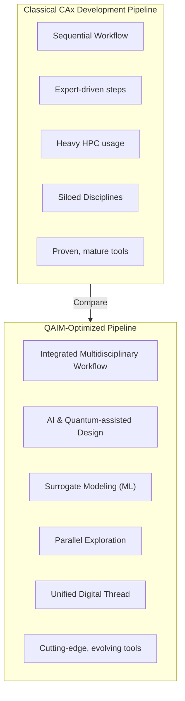

# BWB-Q100 — Transport Civil × Air

Blended Wing Body **BWB** passenger aircraft (variant **Q100**) under the **ASI-T2** portfolio.
This README is organized **Domain → Process (CAx/QOx) → ATA** for clean navigation and traceability.

> **Path Note (canon):** Product roots follow
> `Product_Line_AMPEL360/Model_BWB/variant-Q100/conf_000_baseline/MSN[0001-9999]`
> Certification evidence lives under `domains/<CODE>/ata/ATA-XX/…` with cross-links to CAx/QOx runs and **HUELLΔ** material passports.

---

## Quick Nav

* [Overview](#overview)
* [Canon & Conventions](#canon--conventions-bwbq100)
* [Directory Map (Domain → Process → ATA)](#directory-map-domain--process--ata)
* [Supplier & Vendor Mirrors](#supplier--vendor-mirrors)
* [Domain Index](#domain-index)
* [Domains ↔ CAx (canon) ↔ QOx ↔ ATA](#domains--cax-canon--qox--ata)
* [QAIM-2: CAx → QOx Matrix (SIM)](#qaim-2-cax--qox-matrix-sim)
* [Workflows](#workflows)

  * [Detailed Quantum Optimization Process](#detailed-quantum-optimization-process)
  * [Domain-Specific Quantum Optimization Examples](#domain-specific-quantum-optimization-examples)
  * [Best Practices & Troubleshooting](#best-practices--troubleshooting)
* [Quantum Optimization Performance Metrics](#quantum-optimization-performance-metrics)
* [Evidence & Compliance](#evidence--compliance)
* [Glossary & Acronyms](#glossary--acronyms)
* [FAQ](#bwb-q100--faq)

---

## Overview

Target: **~100-passenger BWB** optimized for **fuel burn ↓, emissions ↓, noise ↓, circularity ↑**.
Engineering follows the **TFA bridge** `QS→FWD→UE→FE→CB→QB`, **UIX.v1**, and **MAL-EEM** ethics.
Every milestone emits **QS/UTCS** evidence and, for physical operations, **HUELLΔ** events → passports → badges.

**Scope anchors**

* **Field:** Transport Civil
* **Environment:** Air
* **Lifecycle:** Domains decomposed into **CAx** processes with **QAIM-2** quantum augmentation (**QOx**)
* **Documentation:** **ATA-aligned** folders per domain; supplier/vendor mirrors ensure traceable ingestion

---

## Canon & Conventions (BWB/Q100)

**Entities (IDEALE canon)**

* **Family:** AMPEL360
* **Model:** BWB
* **Variant:** **Q100** *(configured model)*

**ID grammar (deliverables/artifacts)**
`<PROGRAM>-<FIELD>-<ENV>-<MODEL>-<VAR>-<MSN>-<ARTEFACT>`
Example: `ASIT2-TRANSCIVIL-AIR-BWB-Q100-0001-OV`

**Path grammar (product root)**
`Product_Line_AMPEL360/Model_BWB/variant-Q100/conf_000_baseline/MSN[0001-9999]/…`

**Bridge (TFA canon)**
`QS→FWD→UE→FE→CB→QB` *(evidence flows left→right; gates enforce MAL-EEM)*

**CAx Canon (uniform across all domains)**

* **CAO** — *Computer-Aided Optimization* (MDO/DOE, surrogates, multi-objective)
* **CAD** — *Design* (geometry, topology, BoM of design)
* **CAE** — *Engineering* (FEA/thermal/dynamics; **CFD** lives under `CAE/CFD/`)
* **CAV** — *Verification* (V&V virtual, requirement validation, coverage) ← *(formerly “VP”)*
* **CAM** — *Manufacturing* (toolpaths/NC, additive, fixturing)
* **CAPP** — *Process Planning* (routing, takt, sequencing)
* **CAI** — *HW·SW·AI Integration* (avionics, controls, autonomy)
* **CASE** — *Software Engineering* (req↔tests traceability, coverage)
* **CAT** — *Testing* (environmental/functional/safety: bench/rig/flight)
* **KBE** — *Knowledge-Based Engineering* (rules, constraints, reuse)
* **CIM** — *Computer-Integrated Manufacturing* (plant orchestration, energy/CO₂)

> **PLM** is **not** under CAx. It resides in **`DELs/PLM/`** (config variants, change control, BoMs).

**Domain DELs block (canonical)**
Each `domains/<CODE>/` contains **`DELs/`** with:

* `PAx/` — Physical & Process Aided executions (routing, takt, shop-floor)
* `PLM/` — PDM/PLM configs, variants, change control, BoMs
* `QUANTUM_OA/` — Quantum Optimization & Augmentation (QUBO/BQM, runs)
* `policy/` — local domain policy pins & templates
* `tests/` — CAT/CAV evidence, specs & results

**HUELLΔ (material passports & events)**

* **Events:** `events/<DOMAIN>/<MIC>/<ASSET_UID>/*.json` (signed, policy-pinned)
* **Passports:** `evidence/passports/<DOMAIN>/<ASSET_UID>.json`
* **Badges:** `badges/<DOMAIN>/<ASSET_UID>/*.json` (Shields endpoints)
  Physical ops tie into ATA evidence and SBOMs.

---

## Directory Map (Domain → Process → ATA)

```
Product_Line_AMPEL360/Model_BWB/variant-Q100/conf_000_baseline/MSN[0001-9999]
├── IDEALE/context.manifest.json
├── sbom/AMPEL360/BWB/Q100/…
├── events/AAA/BWQ1/SN-000123/*.json                # HUELLΔ events
├── evidence/passports/AAA/SN-000123.json           # HUELLΔ passport
├── badges/AAA/SN-000123/{trace.json,risk.json,…}   # HUELLΔ badges
└── domains/
    ├── AAA/
    │   ├── cax/
    │   │   ├── CAO/ CAD/ CAE/ CAV/ CAM/ CAPP/ CAI/ CASE/ CAT/ KBE/ CIM/
    │   │   └── CAE/CFD/                             # CFD hosted under CAE
    │   ├── qox/
    │   │   ├── CAO/ CAD/ CAE/ CAV/ CAM/ CAPP/ CAI/ CASE/ CAT/ KBE/ CIM/
    │   ├── ata/{ATA-20,ATA-32,ATA-51,ATA-52,ATA-53,ATA-54,ATA-55,ATA-56,ATA-57}/
    │   ├── pax/{OB,OFF,schemas,scripts}/
    │   └── DELs/{PAx,PLM,QUANTUM_OA,policy,tests}/
    ├── AAP/  # same pattern with DELs/
    ├── CCC/  # same pattern with DELs/
    ├── CQH/  # same pattern with DELs/
    ├── DDD/  # same pattern with DELs/
    ├── EDI/  # same pattern with DELs/
    ├── EEE/  # same pattern with DELs/
    ├── EER/  # same pattern with DELs/
    ├── IIF/  # same pattern with DELs/
    ├── IIS/  # same pattern with DELs/
    ├── LCC/  # same pattern with DELs/
    ├── LIB/  # same pattern with DELs/
    ├── MEC/  # same pattern with DELs/
    ├── OOO/  # same pattern with DELs/
    └── PPP/  # same pattern with DELs/
```

### Supplier & Vendor Mirrors

```
Supplier/
└── Services/
    └── domains/
        ├── AAA/
        │   ├── cax/{CAO,CAD,CAE,CAV,CAM,CAPP,CAI,CASE,CAT,KBE,CIM}/
        │   ├── qox/{…mirror of CAx…}
        │   ├── ata/ATA-XX/
        │   └── DELs/{PAx,PLM,QUANTUM_OA,policy,tests}/
        └── … (all domains mirrored)

Vendors/
└── Components/
    └── domains/
        ├── AAA/
        │   ├── cax/{CAO,CAD,CAE,CAV,CAM,CAPP,CAI,CASE,CAT,KBE,CIM}/
        │   ├── qox/{…mirror of CAx…}
        │   ├── ata/ATA-XX/
        │   └── DELs/{PAx,PLM,QUANTUM_OA,policy,tests}/
        └── … (all domains mirrored)
```

> External SBOMs & HUELLΔ events from suppliers/vendors are ingested in their mirrors and **linked** from product-root ATA docs.

---

## Domain Index

* [AAA — Aerodynamics & Airframes](./domains/AAA/)
* [AAP — Airport Adaptable Platforms](./domains/AAP/)
* [CCC — Cockpit, Cabin & Cargo](./domains/CCC/)
* [CQH — Cryogenics, Quantum & H₂](./domains/CQH/)
* [DDD — Drainage, Dehumidification & Drying](./domains/DDD/)
* [EDI — Electronics & Digital Instruments](./domains/EDI/)
* [EEE — Electrical, Hydraulic & Energy (EHR)](./domains/EEE/)
* [EER — Environmental, Emissions & Remediation](./domains/EER/)
* [IIF — Industrial Infrastructure & Facilities](./domains/IIF/)
* [IIS — Integrated Intelligence & Software](./domains/IIS/)
* [LCC — Linkages, Control & Communications](./domains/LCC/)
* [LIB — Logistics, Inventory & Blockchain](./domains/LIB/)
* [MEC — Mechanical Systems Modules](./domains/MEC/)
* [OOO — OS, Ontologies & Office Interfaces](./domains/OOO/)
* [PPP — Propulsion & Fuel System](./domains/PPP/)

---

## Domains ↔ CAx (canon) ↔ QOx ↔ ATA

> CAx is **canonized**: CAO, CAD, CAE (CFD under CAE), CAV, CAM, CAPP, CAI, CASE, CAT, KBE, CIM.
> QOx mirrors CAx phases one-to-one.

| Domain  | CAx (canon)                                                                                                                                                                                                                                                                                                                                                                                                   | QOx (mirror)                                                                                                                      | ATA docs (links)                                                                                                                                                                                                                                                                                                                                    |
| ------- | ------------------------------------------------------------------------------------------------------------------------------------------------------------------------------------------------------------------------------------------------------------------------------------------------------------------------------------------------------------------------------------------------------------- | --------------------------------------------------------------------------------------------------------------------------------- | --------------------------------------------------------------------------------------------------------------------------------------------------------------------------------------------------------------------------------------------------------------------------------------------------------------------------------------------------- |
| **AAA** | [CAO](./domains/AAA/cax/CAO/) · [CAD](./domains/AAA/cax/CAD/) · [CAE](./domains/AAA/cax/CAE/) · **[CAE/CFD](./domains/AAA/cax/CAE/CFD/)** · [CAV](./domains/AAA/cax/CAV/) · [CAM](./domains/AAA/cax/CAM/) · [CAPP](./domains/AAA/cax/CAPP/) · [CAI](./domains/AAA/cax/CAI/) · [CASE](./domains/AAA/cax/CASE/) · [CAT](./domains/AAA/cax/CAT/) · [KBE](./domains/AAA/cax/KBE/) · [CIM](./domains/AAA/cax/CIM/) | [CAO](./domains/AAA/qox/CAO/) · [CAD](./domains/AAA/qox/CAD/) · [CAE](./domains/AAA/qox/CAE/) · [CAV](./domains/AAA/qox/CAV/) · … | [ATA-51](./domains/AAA/ata/ATA-51/) · [ATA-52](./domains/AAA/ata/ATA-52/) · [ATA-53](./domains/AAA/ata/ATA-53/) · [ATA-54](./domains/AAA/ata/ATA-54/) · [ATA-55](./domains/AAA/ata/ATA-55/) · [ATA-56](./domains/AAA/ata/ATA-56/) · [ATA-57](./domains/AAA/ata/ATA-57/) · [ATA-32](./domains/AAA/ata/ATA-32/) · [ATA-20](./domains/AAA/ata/ATA-20/) |
| **AAP** | [CAO](./domains/AAP/cax/CAO/) · [CAD](./domains/AAP/cax/CAD/) · [CAE](./domains/AAP/cax/CAE/) · [CAV](./domains/AAP/cax/CAV/) · [CAM](./domains/AAP/cax/CAM/) · [CAPP](./domains/AAP/cax/CAPP/) · [CAI](./domains/AAP/cax/CAI/) · [CASE](./domains/AAP/cax/CASE/) · [CAT](./domains/AAP/cax/CAT/) · [KBE](./domains/AAP/cax/KBE/) · [CIM](./domains/AAP/cax/CIM/)                                             | [CAO](./domains/AAP/qox/CAO/) · [CAE](./domains/AAP/qox/CAE/) · [CIM](./domains/AAP/qox/CIM/) · …                                 | [ATA-10](./domains/AAP/ata/ATA-10/) · [ATA-12](./domains/AAP/ata/ATA-12/) · [ATA-28](./domains/AAP/ata/ATA-28/) · [ATA-35](./domains/AAP/ata/ATA-35/)                                                                                                                                                                                               |
| **CCC** | CAx canon set as above                                                                                                                                                                                                                                                                                                                                                                                        | QOx mirror                                                                                                                        | [ATA-25](./domains/CCC/ata/ATA-25/) · [ATA-31](./domains/CCC/ata/ATA-31/) · [ATA-33](./domains/CCC/ata/ATA-33/) · [ATA-38](./domains/CCC/ata/ATA-38/) · [ATA-11](./domains/CCC/ata/ATA-11/)                                                                                                                                                         |
| **CQH** | CAx canon set as above                                                                                                                                                                                                                                                                                                                                                                                        | QOx mirror                                                                                                                        | [ATA-04](./domains/CQH/ata/ATA-04/) · [ATA-17](./domains/CQH/ata/ATA-17/) · [ATA-21](./domains/CQH/ata/ATA-21/) · [ATA-26](./domains/CQH/ata/ATA-26/) · [ATA-28](./domains/CQH/ata/ATA-28/) · [ATA-36](./domains/CQH/ata/ATA-36/) · [ATA-47](./domains/CQH/ata/ATA-47/)                                                                             |
| **DDD** | CAx canon set as above                                                                                                                                                                                                                                                                                                                                                                                        | QOx mirror                                                                                                                        | [ATA-13](./domains/DDD/ata/ATA-13/) · [ATA-14](./domains/DDD/ata/ATA-14/)                                                                                                                                                                                                                                                                           |
| **EDI** | CAx canon set as above                                                                                                                                                                                                                                                                                                                                                                                        | QOx mirror                                                                                                                        | [ATA-31](./domains/EDI/ata/ATA-31/) · [ATA-23](./domains/EDI/ata/ATA-23/) · [ATA-34](./domains/EDI/ata/ATA-34/) · [ATA-46](./domains/EDI/ata/ATA-46/) · [ATA-42](./domains/EDI/ata/ATA-42/) · [ATA-33](./domains/EDI/ata/ATA-33/)                                                                                                                   |
| **EEE** | CAx canon set as above                                                                                                                                                                                                                                                                                                                                                                                        | QOx mirror                                                                                                                        | [ATA-24](./domains/EEE/ata/ATA-24/) · [ATA-28](./domains/EEE/ata/ATA-28/) · [ATA-29](./domains/EEE/ata/ATA-29/) · [ATA-36](./domains/EEE/ata/ATA-36/) · [ATA-49](./domains/EEE/ata/ATA-49/)                                                                                                                                                         |
| **EER** | CAx canon set as above                                                                                                                                                                                                                                                                                                                                                                                        | QOx mirror                                                                                                                        | [ATA-21](./domains/EER/ata/ATA-21/) · [ATA-31](./domains/EER/ata/ATA-31/) · [ATA-38](./domains/EER/ata/ATA-38/) · [ATA-78](./domains/EER/ata/ATA-78/)                                                                                                                                                                                               |
| **IIF** | CAx canon set as above                                                                                                                                                                                                                                                                                                                                                                                        | QOx mirror                                                                                                                        | [ATA-20](./domains/IIF/ata/ATA-20/) · [ATA-51](./domains/IIF/ata/ATA-51/)                                                                                                                                                                                                                                                                           |
| **IIS** | CAx canon set as above                                                                                                                                                                                                                                                                                                                                                                                        | QOx mirror                                                                                                                        | [ATA-46](./domains/IIS/ata/ATA-46/) · [ATA-42](./domains/IIS/ata/ATA-42/) · [ATA-22](./domains/IIS/ata/ATA-22/) · [ATA-45](./domains/IIS/ata/ATA-45/)                                                                                                                                                                                               |
| **LCC** | CAx canon set as above                                                                                                                                                                                                                                                                                                                                                                                        | QOx mirror                                                                                                                        | [ATA-22](./domains/LCC/ata/ATA-22/) · [ATA-23](./domains/LCC/ata/ATA-23/) · [ATA-27](./domains/LCC/ata/ATA-27/) · [ATA-34](./domains/LCC/ata/ATA-34/) · [ATA-46](./domains/LCC/ata/ATA-46/)                                                                                                                                                         |
| **LIB** | CAx canon set as above                                                                                                                                                                                                                                                                                                                                                                                        | QOx mirror                                                                                                                        | [ATA-20](./domains/LIB/ata/ATA-20/) · **51–57** · **70–79**                                                                                                                                                                                                                                                                                         |
| **MEC** | CAx canon set as above                                                                                                                                                                                                                                                                                                                                                                                        | QOx mirror                                                                                                                        | [ATA-27](./domains/MEC/ata/ATA-27/) · [ATA-29](./domains/MEC/ata/ATA-29/) · [ATA-32](./domains/MEC/ata/ATA-32/) · [ATA-30](./domains/MEC/ata/ATA-30/) · [ATA-36](./domains/MEC/ata/ATA-36/) · [ATA-35](./domains/MEC/ata/ATA-35/) · [ATA-21](./domains/MEC/ata/ATA-21/) · [ATA-38](./domains/MEC/ata/ATA-38/)                                       |
| **OOO** | CAx canon set as above                                                                                                                                                                                                                                                                                                                                                                                        | QOx mirror                                                                                                                        | [ATA-46](./domains/OOO/ata/ATA-46/) · [ATA-45](./domains/OOO/ata/ATA-45/)                                                                                                                                                                                                                                                                           |
| **PPP** | CAx canon set as above                                                                                                                                                                                                                                                                                                                                                                                        | QOx mirror                                                                                                                        | [ATA-70](./domains/PPP/ata/ATA-70/) … [ATA-79](./domains/PPP/ata/ATA-79/) · [ATA-28](./domains/PPP/ata/ATA-28/) · [ATA-49](./domains/PPP/ata/ATA-49/)                                                                                                                                                                                               |

---

## QAIM-2: CAx → QOx Matrix (SIM)

> **Reference**: full QAIM-2 framework at `FIELDS/cross/QAIM-2/` (18 domains, strategies, templates).



### BWB-Q100 Optimization Matrix (excerpt)

| CAx (canon) | (i) Optimize target   | (ii) Quantum mapping                       | (iii) SIM lever             | (iv) Maturity  |
| ----------- | --------------------- | ------------------------------------------ | --------------------------- | -------------- |
| **CAO**     | Global MDO / DOE      | QUBO/BQM → Annealing/QAOA                  | Fewer runs; better fronts   | Pilot          |
| **CAD**     | Layout/topology       | QUBO/BQM → QAOA/Annealing; VQE subproblems | Material ↓; drag ↓          | Pilot/Research |
| **CAE/CFD** | Operating points; DOE | QUBO for DOE; exploratory QLSA/HHL         | Fuel burn ↓; emissions ↓    | Research       |
| **CAV**     | Test plan selection   | QUBO/BQM → QAOA/Annealing                  | Test time/energy ↓          | Pilot          |
| **CAM**     | Toolpath/sequence     | Job/flow-shop QUBO                         | Energy/idle ↓; throughput ↑ | Pilot          |
| **CAPP**    | Routing; takt balance | QUBO/BQM                                   | WIP ↓; takt adherence ↑     | Pilot          |
| **PLM***    | Variant/change impact | Multi-objective QUBO (hybrid)              | Rework ↓; circularity ↑     | Pilot          |

*PLM sits under DELs but participates in QAIM-2 decisions.

---

## Workflows

### High-Level Process Flow (CAx/QOx + HUELLΔ)

1. **Model (CAx)** → commit in `domains/<CODE>/cax/<PHASE>/…`.
2. **Encode (QOx)** → emit QUBO/BQM into `domains/<CODE>/qox/<PHASE>/problems/`.
3. **Solve** → run `qaoa/`/`annealing/` → outputs to `domains/<CODE>/qox/<PHASE>/runs/<YYYYMMDD-HHMMSS>/` (auto **QS/UTCS**).
4. **Document (ATA)** → update `domains/<CODE>/ata/ATA-XX/` with references & evidence hashes.
5. **HUELLΔ** (if physical) → signed events → passport → badges.
6. **Gate** → PR includes UTCS anchors; **MAL-EEM** enforced.

### Detailed Quantum Optimization Process

*(unchanged in essence; aligned to CAx canon)*

1. **Classical Modeling (CAx)** → identify optimization opportunities.
2. **Quantum Encoding (QOx)** → QUBO/BQM, penalties, multi-objective weights.
3. **Algorithm & Execution** → QAOA/Annealing/VQE; hybrid post-processing.
4. **Solution Validation** → classical checks, constraints, benchmarks, SIM impacts.
5. **Traceability** → QS/UTCS hashes, policy pins, ATA evidence.

### Domain-Specific Examples

**AAA (Airframes) — Wing Design Optimization**

* CAx: `domains/AAA/cax/CAD/wing_optimization_baseline/`
* QOx: `domains/AAA/qox/CAD/problems/wing_topology_v1.json` → `runs/20250122-143052/`
* ATA: `domains/AAA/ata/ATA-57/wing_quantum_optimization.md`

**PPP (Propulsion) — Engine Operating Point Optimization**

* CAx: `domains/PPP/cax/CAE/CFD/` (DOE)
* QOx: annealing for DOE + QAOA for operating points
* ATA: `domains/PPP/ata/ATA-70…79/` + SIM/LCA refs

**MEC (Mechanical) — Landing Gear Topology**

* CAx: `domains/MEC/cax/CAE/`
* QOx: VQE (materials) + QAOA (topology)
* ATA: `domains/MEC/ata/ATA-32/`

### Best Practices & Troubleshooting

* **Formulation:** reduce variables; penalty weights 10×–100× objective scale.
* **QAOA:** increase p gradually; Bayesian tuning.
* **Annealing:** schedule & chain-strength tuning.
* **Validation:** classical baselines on small instances; multi-run stats; SIM deltas.

---

## Quantum Optimization Performance Metrics

**Technical**: solution quality (≤10% gap), success probability (≥70%), time-to-solution, scalability.
**Sustainability (SIM)**: fuel ↓ (5–15%), emissions ↓ (10–20%), weight ↓ (5–25%), energy ↓ (10–30%).
**Business**: iteration cycle ↓ (20–50%), cost ↓ (5–15%), defects ↓ (10–40%).

**Targets (illustrative)**

* **QAOA**: ~100 variables, p=3, <1000 qubits, <10 min runtime.
* **Annealing**: 1k–5k vars, 1–100 μs anneal, <1 min total.
* **VQE**: 10–100 qubits for materials; chemical accuracy ~1 kcal/mol (FT preferred).

---

## Evidence & Compliance

* **UTCS/QS**: deterministic provenance (hashes of policy/model/data/operator) per run.
* **HUELLΔ**: signed interaction events (privacy by geohash truncation), passports, badges.
* **Standards**: ATA folders are **authoritative** for audits; cross-link CAx/QOx & HUELLΔ evidence.
* **SBOM**: SPDX 2.3 at `sbom/AMPEL360/BWB/Q100/…` for software & embedded artifacts.
* **Ethics**: **MAL-EEM** guard active across all agents; fail-closed behavior at gates.

---

## Glossary & Acronyms

**Domains** — AAA, AAP, CCC, CQH, DDD, EDI, EEE, EER, IIF, IIS, LCC, LIB, MEC, OOO, PPP.
**Core** — ASI-T2, BWB, TFA, UTCS/QS, UIX, MAL-EEM.
**CAx (canon)** — CAO, CAD, CAE (CFD), CAV, CAM, CAPP, CAI, CASE, CAT, KBE, CIM.
**QOx** — per-phase quantum counterparts (QAOA/Annealing/VQE/HHL/QLSA).
**Sustainability** — SIM, LCA (ISO 14040/44), GHG Scopes 1–3.
**Ops** — OTIF, FMEA, SIL/HIL, MBD, BOM, AGV, APU.

---

## BWB-Q100 — FAQ

**Q1. Mission?**
~100-passenger BWB optimized for **fuel/emissions/noise ↓** and **circularity ↑**; governed by TFA, UIX.v1, MAL-EEM; QS/UTCS at every gate.

**Q2. Where do I work?**
`domains/<CODE>/{cax|qox}/<PHASE>/…` and `domains/<CODE>/ata/ATA-XX/…`.
Example: Wing CFD → `AAA/cax/CAE/CFD/` → QOx DOE in `AAA/qox/CAE/` → docs in `AAA/ata/ATA-57/`.

**Q3. Add a new CAx study?**
Create under CAx canon (e.g., `cax/CAE/…`) with README, inputs, configs, results, UTCS anchors.

**Q4. Produce a QOx run?**
Encode decision as QUBO/BQM in `qox/<PHASE>/problems/`, solve to `qox/<PHASE>/runs/<TS>/`, attach QS/UTCS.

**Q5. Where are ATA docs & evidence?**
`domains/<CODE>/ata/ATA-XX/`, linking CAx/QOx artefacts (relative paths + hash digests).

**Q6. Multi-domain work?**
Primary ownership in most responsible domain, cross-link secondary impacts in their ATA folders.

**Q7. Revisions (HOV)?**
Use `_revisions/REV_<LETTER>/HOV_<MSN_RANGE>_<PHASES>/…` mirroring the same structure; keep filenames stable; encode rev in path.

**Q8. SIM/LCA results?**
Attach to each QOx run under `runs/<ts>/sim_lca/` and cite in ATA docs.

**Q9. Minimal PR that passes gates?**
CAx content + README, matching QOx problem & ≥1 run, QS/UTCS blobs, ATA doc updates, MAL-EEM pass.

**Q10. Common systems map?**

* Autoflight (ATA-22): `LCC` (controls) / `IIS` (software)
* Info Systems (ATA-46): `OOO` + `IIS`
* Electrical Power (ATA-24): `EEE`
* Fuel/H₂ (ATA-28): `PPP` (on-board) + `AAP` (ground)
* Structures (ATA-51–57): `AAA` (airframe) + `MEC` (mech)

**Q11. Quantum method pick?**
Routing/layout/scheduling → QAOA/Annealing; materials → VQE; large linear/PDE → HHL/QLSA (research).

**Q12. Validate quantum results?**
Classical benchmarks; constraint checks; multi-run stats; physical validation in CAx; SIM impact quantified.

**Q13. Compliance & safety artefacts?**
Under owning CAx phase (`CAT/`, `CAV/`) with links into ATA; mirror any QOx optimization and attach QS/UTCS.

**Q14. Troubleshoot quantum performance?**
Check formulation (conditioning, penalties), parameters (p, schedule), hardware (embedding, noise), and validate solutions.

**Q15. Resource guidelines?**
10–50 vars → QAOA/VQE (✓ today); 50–200 → QAOA/Annealing (✓); 200–1000 → Annealing/Hybrid (✓); >1000 → Annealing/roadmap.

**Q16. Integrate with CAx?**
Pre-process with quantum seed; hybrid loop; multi-objective split (quantum discrete, classical continuous); document in ATA with hashes.

---

### HUELLΔ Appendix (Material Passports — Canon Hooks)

* **Events:** `events/<DOMAIN>/<MIC>/<ASSET_UID>/*.json` (signed, policy-pinned; geohash truncation; no PII).
* **Verifier:** `tools/ief_verify_events.py` (no external deps).
* **Badges:** Shields endpoints under `badges/<DOMAIN>/<ASSET_UID>/`.
* **Passport:** `evidence/passports/<DOMAIN>/<ASSET_UID>.json` aggregates energy/CO₂, quality, risk, coverage.

> **Policy invariants:** signed or it doesn’t exist; paths relative; deterministic metrics; replayable with same inputs.

---

**End of canonical README (BWB-Q100)**

