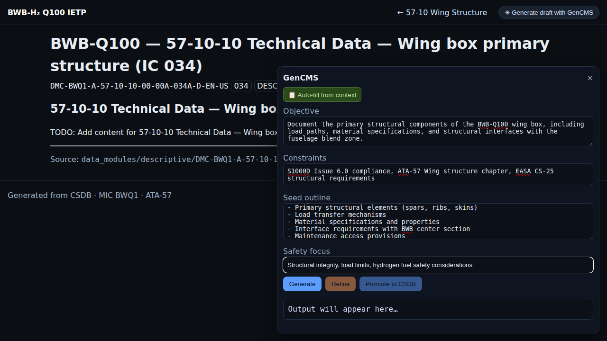

# BWB-H₂ Q100 — ATA-57 Authoring User Guide

## 1. Purpose & Audience

This guide explains how to author, review, and integrate S1000D Issue 6.0 content for ATA-57 Wings (MIC **BWQ1**), use the IETP, leverage GenCMS safely, and pass CI validation.

**Target Audience:**
- Technical authors creating S1000D data modules
- Reviewers and quality assurance personnel
- System integrators and documentation managers
- Training personnel and content managers

## 2. Authoring Buckets & Information Codes (ATA-57)

### Information Code Mapping for ATA-57

| Subsystem | Primary ICs | Notes |
|-----------|-------------|-------|
| 57-10 Wing Structure | 040, 034, 350/345 | General/overviews (040), physical breakdowns (034), proof/stiffness tests (350/345) |
| 57-20 Fuel Interfaces | 040, 350, 345 | Functional check (350), leak test (345) |
| 57-30 Control Surfaces | 5xx, 7xx, 345 | Removal (5xx), Installation/Rig (7xx), operational checks (345) |
| 57-40 High-Lift | 7xx, 345, 042 | Install/adjust (7xx), asymmetry test (345), description/logic (042) |
| 57-50 Equipment Integration | 040, 050–056 | Descriptions (040/050–056 as needed) |
| Fault Isolation (all) | 420, 421–428 | General FI (420); system-specific trees (421–428) |

### ATA-57 Authoring Buckets

- **Description**: **040, 042, 034, 050–056**
- **Tests**: **310, 345, 350**
- **Removal**: **5xx**
- **Install/Rig**: **7xx**
- **Servicing**: **6xx**
- **FI-General**: **420**
- **FI-Specific**: **421–428**
- **IPD/Parts**: **900, 910**

## 3. Module Types

### [Descriptive Modules](modules/descriptive.md) (040/042/034/050–056)
Technical descriptions, system overviews, and component specifications.

### [Procedural Modules](modules/procedural.md) (2xx/5xx/6xx/7xx)
Step-by-step procedures for maintenance, removal, installation, and servicing.

### [Fault Isolation Modules](modules/fault-isolation.md) (420, 421–428)
Troubleshooting procedures and system-specific fault isolation trees.

### [IPD/Parts Modules](modules/ipd.md) (900/910)
Illustrated Parts Data with interactive components and part catalogs.

### [Publication Modules](modules/publication-modules.md) (PM/DML/DMRL)
Publication structure and data module requirements management.

### [Common Information Repository](modules/cir.md) (CIR)
Shared terminology, references, and configuration data.

## 4. GenCMS (Generative Content Management System)

The GenCMS provides AI-assisted content generation with S1000D compliance guardrails.

### Key Features
- Context-aware prefill from existing data modules
- BREX and CSDB rules enforcement
- Safety-focused content generation
- Direct promotion to CSDB

**See**: [Complete GenCMS Guide](modules/gencms.md)

## 5. IETP (Interactive Electronic Technical Publication)

The IETP provides a web-based interface for browsing and managing S1000D content.

### Features
- Category filtering by information code
- Full-text search across titles and DM keys
- Status indicators (authored vs pending)
- Direct access to GenCMS for content generation

**See**: [IETP Usage Guide](modules/ietp.md)

## 6. Validation & CI

All content undergoes automated validation using:
- XSD-only schema validation (no DTD)
- BREX business rules compliance
- CSDB structure and naming validation
- Coverage verification against DMRL requirements

**See**: [Validation and CI Guide](modules/validation-and-ci.md)

## 7. BREX and CSDB Rules Enforcement

### Classification Requirements
- Use en-dash (–) in classification strings: `INTERNAL–EVIDENCE-REQUIRED`
- Never use hyphen (-) in classification

### Schema Selection
- Descriptive content: `descript.xsd`
- Procedural content: `proced.xsd`
- IPD content: `ipd.xsd`
- Publication modules: `pm.xsd`

### MIC Consistency
- Always use **BWQ1** as Model Identification Code
- Maintain consistent enterprise naming: **AMPEL360**

## 8. Quick Reference Checklists

### Before Authoring
- [ ] Verify DMRL entry exists for your data module
- [ ] Confirm information code mapping is correct
- [ ] Check for existing related modules and cross-references
- [ ] Review applicable BREX rules and constraints

### Content Creation
- [ ] Use GenCMS prefill for context-aware initialization
- [ ] Include required safety warnings and cautions
- [ ] Follow S1000D Issue 6.0 markup standards
- [ ] Verify multimedia object references are valid
- [ ] Include proper effectivity and applicability

### Review and Validation
- [ ] Schema validation passes (XSD)
- [ ] BREX rules compliance verified
- [ ] Classification string uses en-dash
- [ ] CSDB naming convention followed
- [ ] Cross-references resolve correctly

### Common Mistakes to Avoid
- Using hyphen (-) instead of en-dash (–) in classification
- Incorrect information code selection for content type
- Missing required metadata elements
- Improper multimedia object file naming
- Inconsistent MIC usage across related modules

---

**Last Updated**: 2025-01-21  
**S1000D Version**: 6.0  
**Classification**: INTERNAL–EVIDENCE-REQUIRED