# ATA-42 OS Test Documentation

## Overview

This document defines the verification strategy, procedures, test cases, datasets, environments, and objective evidence for the BWB-Q100 AQUA-OS operating system. It aligns with DO-178C (DAL A), DO-330 (tool qualification), ARINC 653 (APEX), DO-297 (IMA roles/integration), and interfaces with ARP4754B/ARP4761A system safety assessments.

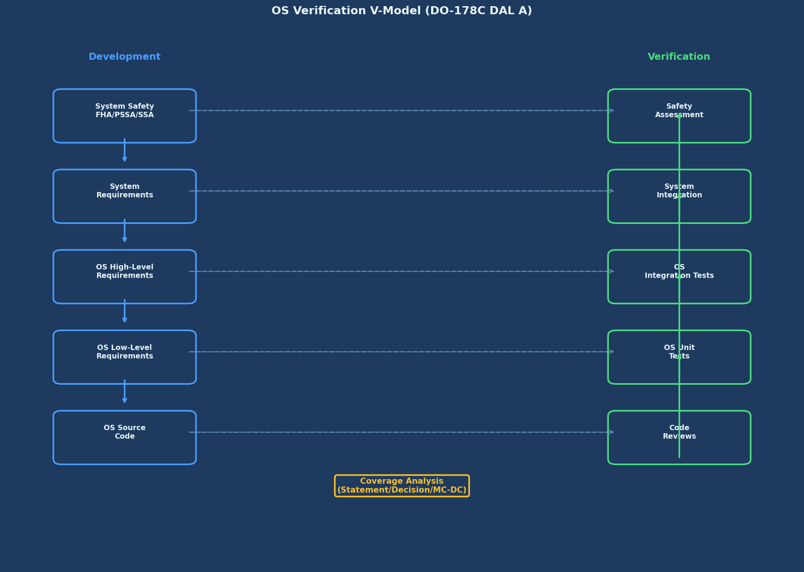
*Figure 1: High-level verification V-model showing links between system safety (FHA/PSSA/SSA) and OS verification artifacts (requirements, tests, coverage, results)*

## Contents

1. [Integration Procedures](#integration-procedures)  
2. [Test Procedures](#test-procedures)  
3. [Test Cases](#test-cases)  
4. [Test Data & Datasets](#test-data--datasets)  
5. [Environments & Instrumentation](#environments--instrumentation)  
6. [Results & Metrics](#results--metrics)  
7. [Coverage Analysis](#coverage-analysis)  
8. [Compliance & Traceability](#compliance--traceability)  
9. [Anomalies & Problem Reports](#anomalies--problem-reports)  
10. [Appendix A — Templates](#appendix-a--templates)  
11. [Source Data Modules](#source-data-modules)  
12. [Related Publications](#related-publications)  
13. [Related Resources](#related-resources)

---

## Integration Procedures

### Hardware Preparation

**Prerequisites**
- CPIOM test bench v2.1 or later with calibrated PSU and thermal monitor  
- Serial console (115200-8-N-1)  
- Dual AFDX interfaces (A/B) connected to test switch fabric  
- Time sync source (PTP or IRIG-B)  
- Logic analyzer or trace probe (optional)  

**Steps**

1) **Prepare Target Hardware**
- Connect PSU (OVP/OCP enabled), serial console, and AFDX A/B.
- Verify switch fabric BAG/Lmax policing profiles.
- Attach time sync and confirm grandmaster lock.

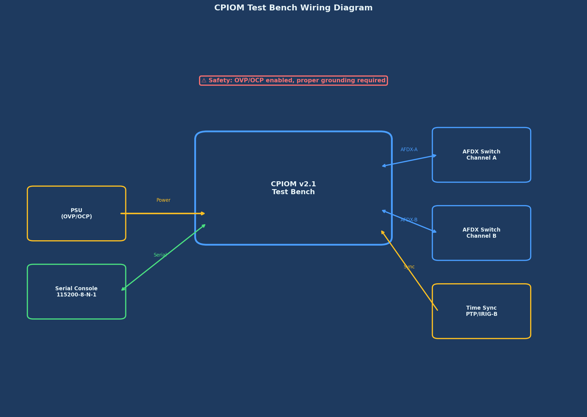
*Figure 2: Bench wiring diagram showing CPIOM connections to dual AFDX, serial console, PSU, and time sync source*

2) **Load OS Kernel**
- Transfer kernel image via bootloader (USB/UART/Ethernet).
- Verify image SHA-256 and signature.
- Set boot params (major_frame_ms, HM policy, console level).
- Start COLD BOOT.

3) **Configure System**
- Load static configuration: `schedule.xml`, `memory_map.xml`, `HM_Table.xml`, `io_map.yaml`.
- Validate against schemas; reject on error.
- Lock configuration hashes in bootloader NVRAM.

4) **Load Partition Applications**
- Transfer signed binaries; verify signatures (certificate chain).
- Bind windows and IPC ports; declare shared memory (if any) with R/W policies.

5) **Verify Configuration**
- Schema validation, memory layout checks, schedule feasibility (no overlaps).
- Dry-run IPC link integrity; verify permissions.

6) **Perform Integration Smoke Tests**
- Boot sequence baseline (TP-001).
- Partition isolation (TP-002).
- IPC round-trip (TP-005-SMK).
- I/O loopback basic (A429/AFDX).

---

## Test Procedures

> **Notation:** Each TP includes Objective, Preconditions, Procedure, Measurements, Pass Criteria, and Evidence.

### TP-001: Boot Sequence Test

**Objective**  
Verify OS completes boot and initializes critical services within time and without errors.

**Preconditions**  
- Clean NVRAM; valid signed images; serial logger armed.

**Procedure**  
1. Power on test bench.  
2. Capture boot timestamps for: ROM handoff → SK init → PM ready → HM ready → IPC ready → Schedule Start.  
3. Compute boot duration and component latencies.  
4. Verify critical services registrations and no HM fatal events.

**Measurements**  
- `t_boot_total ≤ 5.0 s`  
- Component latencies logged with ±1 ms resolution.

**Pass Criteria**  
- Boot ≤ 5.0 s, all services ready, no errors of class ≥ MAJOR.

**Evidence**  
- `logs/boot/boot_serial_YYYYMMDD_HHMMSS.log` (hash)  
- `artifacts/metrics/boot_profile.json`

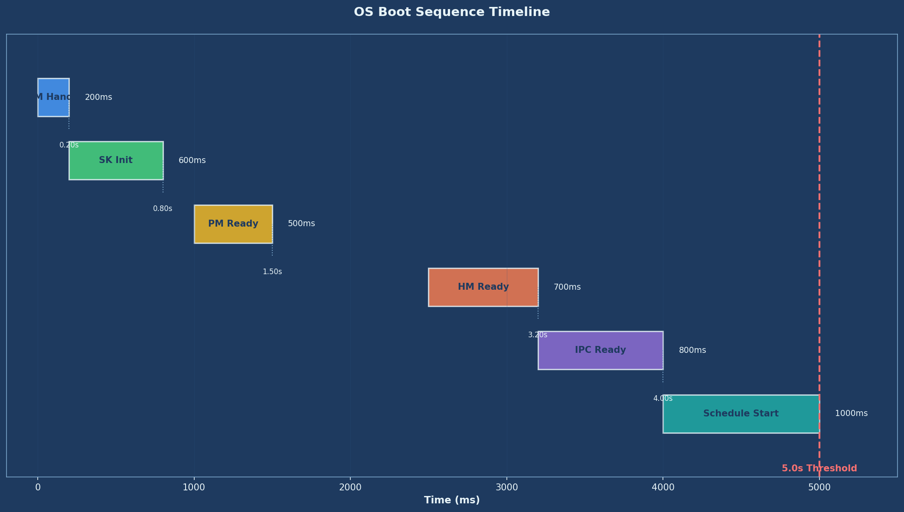
*Figure 3: Boot timeline showing phases and durations with 5.0s threshold marker*

---

### TP-002: Partition Isolation Test

**Objective**  
Demonstrate freedom from interference in time/space.

**Preconditions**  
- Isolation test partitions loaded (mem_probe, cpu_probe).

**Procedure**  
1. Run `mem_probe` to attempt out-of-range reads/writes.  
2. Introduce CPU load in partition A; measure window stability in partition B.  
3. Attempt unauthorized shared memory access and IPC misuse.

**Measurements**  
- MMU faults (address, partition, timestamp).  
- Window jitter of unaffected partitions (µs).  
- HM actions executed.

**Pass Criteria**  
- No cross-partition memory access; HM reports violations; unaffected windows jitter ≤ 1 µs; recovery per policy.

**Evidence**  
- `logs/hm/hm_events_*.csv`, `artifacts/timing/window_jitter_*.json`

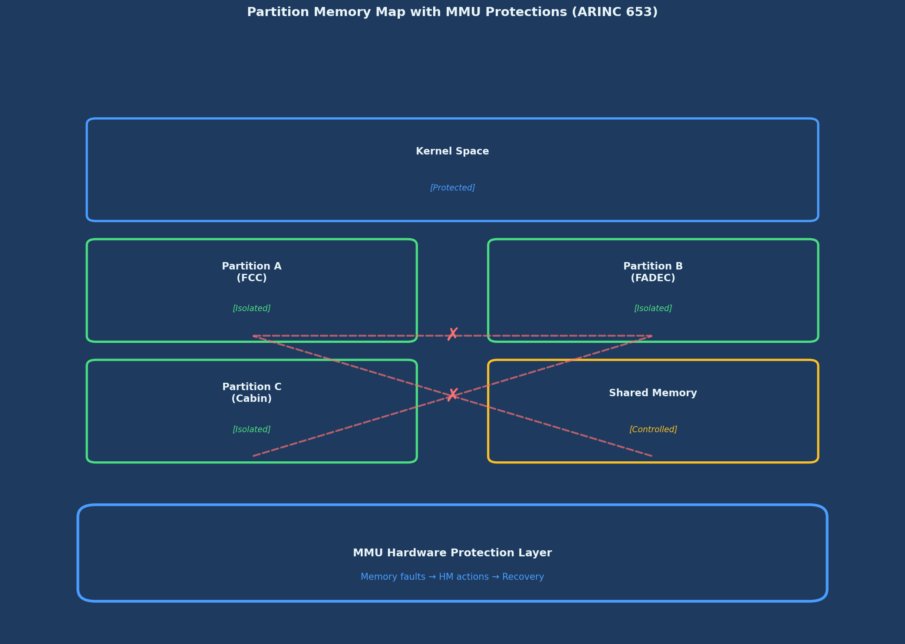
*Figure 4: Partition map with MMU protections showing isolated regions and denied access controls*

---

### TP-003: Security Validation Test (Airworthiness Security Touchpoints)

**Objective**  
Verify secure boot, crypto libraries, access control, and audit logging per DO-326A/356A process.

**Preconditions**  
- Valid trust anchors in secure storage; tamper switch accessible.

**Procedure**  
1. Validate secure boot with good/bad images (signature mismatch test).  
2. Exercise crypto ops (AES-GCM, SHA-256, ECDSA) with KATs.  
3. Attempt privileged service from unprivileged partition (expect deny).  
4. Toggle tamper switch; verify HM + audit log entry.

**Measurements**  
- KAT pass/fail, key usage, audit completeness.

**Pass Criteria**  
- Secure boot blocks tampered images; KATs pass; least privilege enforced; audit log complete.

**Evidence**  
- `logs/security/audit_*.json`, `artifacts/crypto/KAT_report.txt`

---

### TP-004: Health Monitor (HM) Test

**Objective**  
Validate detection → action pathways and timing.

**Procedure**  
1. Inject DEADLINE_MISS in FCC_A; observe HM and recovery policy (HOT then WARM).  
2. Trigger MEMORY_VIOLATION; expect STOP_PARTITION.  
3. Induce TIME_SYNC_LOSS; expect ALERT + LOG.

**Measurements**  
- Detection latency ≤ 50 ms; action execution logged.

**Pass Criteria**  
- All injected faults detected; actions match HM table; system stable post-recovery.

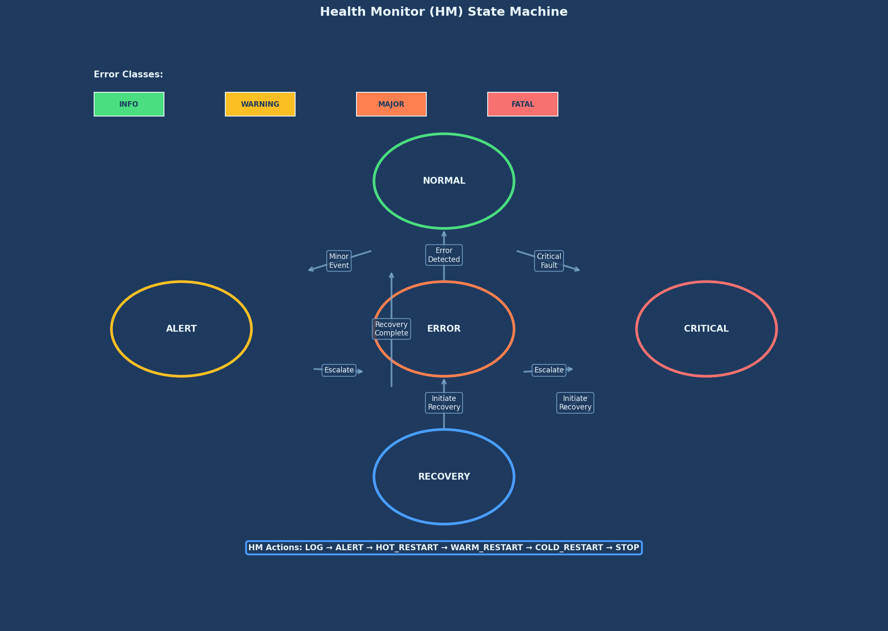
*Figure 5: Health Monitor state machine showing error classes, actions, and escalation ladder*

---

### TP-005: Inter-Partition Communication (IPC) Test

**Objective**  
Verify sampling/queuing semantics, ordering, and timing.

**Procedure**  
1. Configure ports; send patterns (sawtooth, PRBS).  
2. Validate sampling freshness and queuing order/overflow policy.  
3. Perform end-to-end latency measurement.

**Measurements**  
- Sampling age ≤ configured validity; queuing order preserved; p99 latency ≤ budget.

**Pass Criteria**  
- All checks within declared budgets; error handling correct.

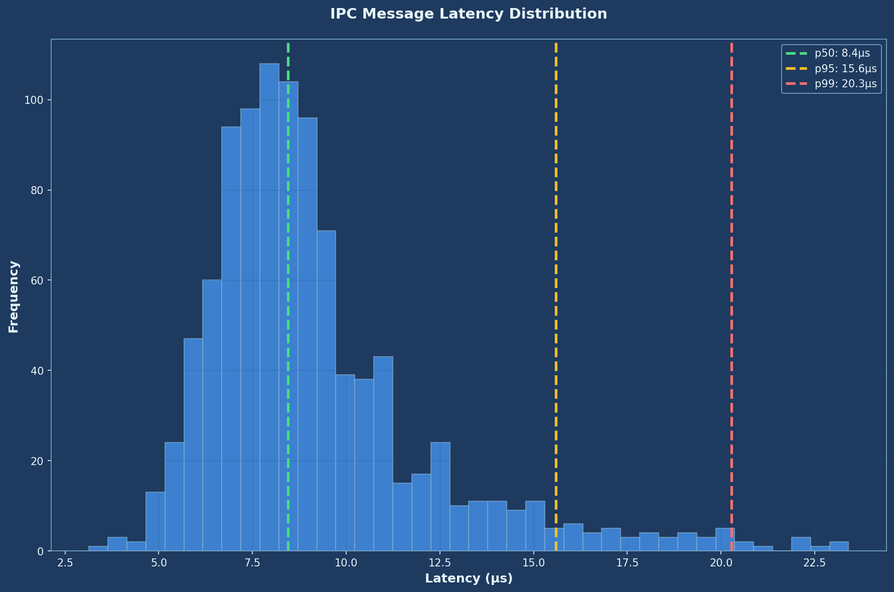
*Figure 6: IPC message latency histogram with p50, p95, and p99 percentile markers*

---

### TP-006: Performance & Determinism

**Objective**  
Measure kernel/IPC performance and scheduling jitter.

**Procedure**  
1. Run benchmark suite; measure context switch, syscall, interrupt latency.  
2. Stress with mixed workloads; monitor jitter.

**Targets (typical platform)**  
- Context switch ≤ 10 µs  
- Interrupt latency ≤ 5 µs  
- Syscall overhead ≤ 2 µs  
- Scheduling jitter ≤ 1 µs

**Pass Criteria**  
- All metrics ≤ targets or justified by platform limits with risk assessment.

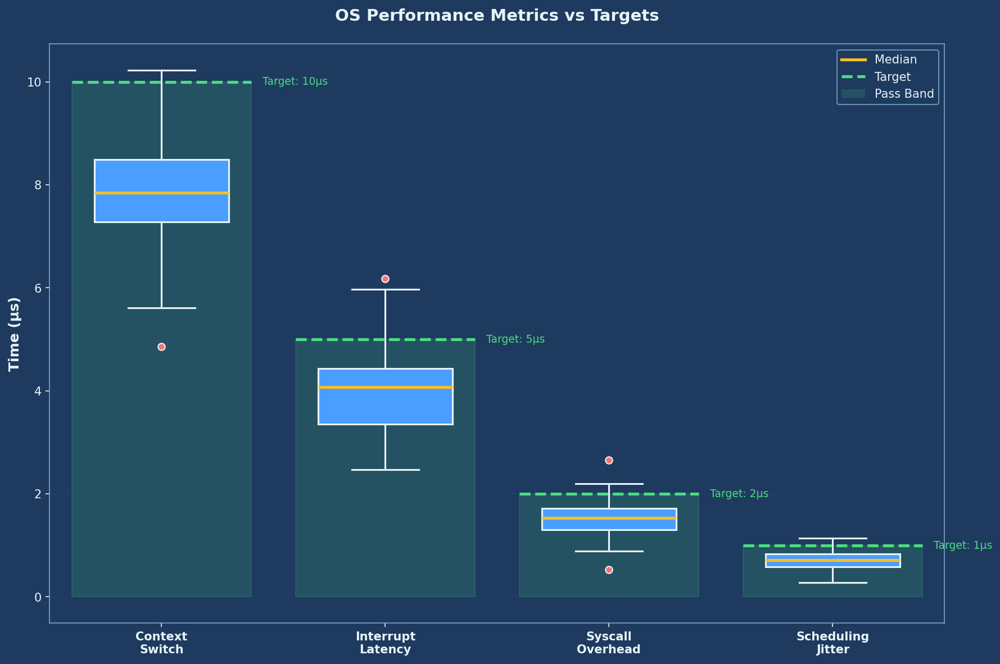
*Figure 7: OS performance metrics box plots with target thresholds and pass bands*

---

## Test Cases

Test cases are maintained under `testing/test_cases/` and are schema-validated.

- [tc_os_boot.xml](../../testing/test_cases/tc_os_boot.xml) — Boot sequence  
- [tc_partition_isolation.xml](../../testing/test_cases/tc_partition_isolation.xml) — Isolation  
- [tc_security_validation.xml](../../testing/test_cases/tc_security_validation.xml) — Security

**Test Case XML Schema (summary)**
- `TestCase` → `id`, `objective`, `preconditions`, `steps[]`, `measurements[]`, `pass_criteria[]`, `artifacts[]`, `trace_refs[]`.

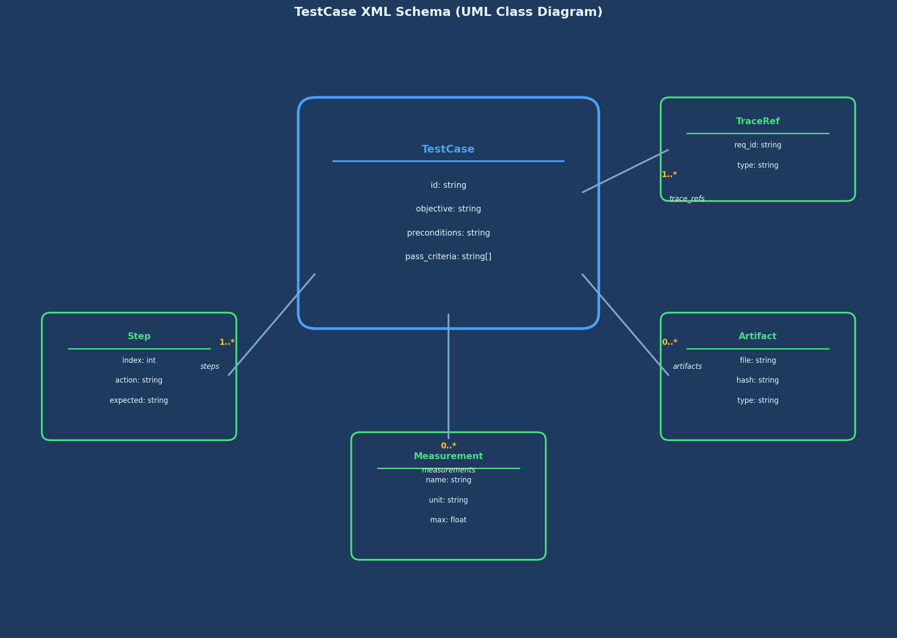
*Figure 8: UML class diagram of TestCase XML schema and relationships*

---

## Test Data & Datasets

- **Deterministic patterns:** counters, PRBS-7/15, edge-case payloads.  
- **Fault injection scripts:** timing overruns, MMU violations, truncated frames.  
- **Golden outputs:** known-good logs and metrics with hashes.

All datasets are stored in `testing/data/` with `manifest.yaml` capturing origin, schema, and SHA-256.

---

## Environments & Instrumentation

**Environments**
- `env_hw_cpiom_v2_1`: hardware bench (default)  
- `env_sim_qemu_a653`: virtualization/sim for non-timing tests

**Instrumentation**
- Serial logger, monotonic clock tracer, network capture, optional HW trace.

**Clock & Sync**
- PTP/IRIG-B locked; out-of-lock tests annotated.

**Tool Qualification**
- Tools used for verification with certification credit are qualified per DO-330; TQL levels and evidence recorded in `../../compliance/DO-330_evidence/`.

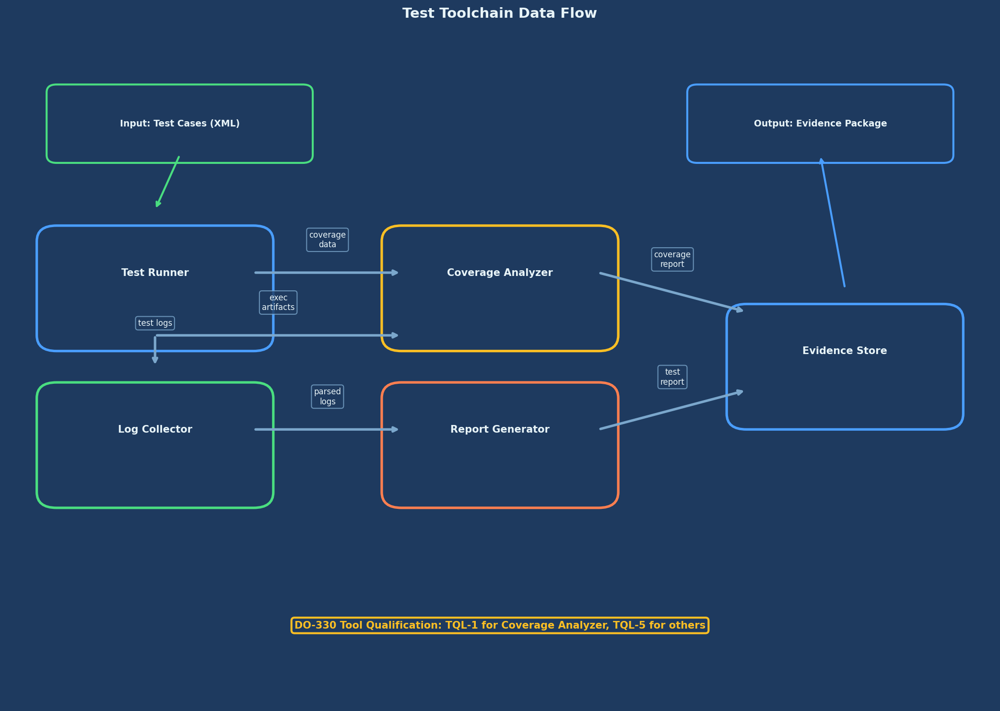
*Figure 9: Toolchain block diagram showing test runner, log collector, coverage analyzer, report generator, and data flow*

---

## Results & Metrics

### Recent Test Executions

| Test Run | Date | Status | Report |
|---|---|---|---|
| Boot Sequence | 2024-05-15 | ✅ Pass | [View](../../testing/test_results/tr_os_boot_20240515.md) |
| Security Validation | 2024-05-20 | ✅ Pass | [View](../../testing/test_results/tr_security_20240520.md) |

### Summary Statistics (Illustrative)

| Category | Total | Passed | Failed | Pass Rate |
|---|---:|---:|---:|---:|
| Boot | 25 | 25 | 0 | 100% |
| Isolation | 50 | 50 | 0 | 100% |
| Security | 75 | 75 | 0 | 100% |
| Health Monitor | 40 | 40 | 0 | 100% |
| Communication | 60 | 60 | 0 | 100% |
| Performance | 30 | 30 | 0 | 100% |
| **Total** | **280** | **280** | **0** | **100%** |

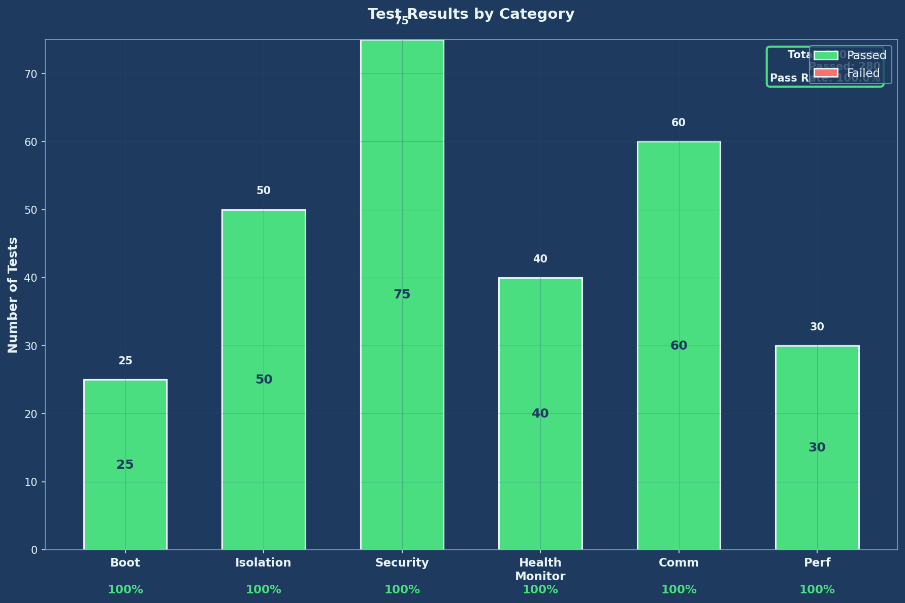
*Figure 10: Stacked bar chart of test results by category showing pass/fail distribution*

---

## Coverage Analysis

**Targets (DAL A)**  
- Statement: 100%  
- Decision/Branch: 100%  
- MC/DC: 100% or justified per DO-178C §6.4.4.2 (e.g., deactivated code, defensive constructs)

**Status (Illustrative)**  
- Statement: 100% ✅  
- Decision: 100% ✅  
- MC/DC: 99.2% ✅ (remaining 0.8% justified: defensive handlers + deactivated code under certified configuration)

Method: structural coverage from instrumented builds; independent review of uncovered elements; linkage to requirements/tests; justifications recorded in `../../compliance/DO-178C_evidence/coverage_justification/`.

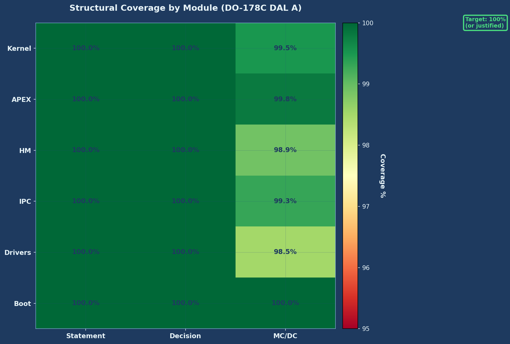
*Figure 11: Coverage heatmap by module (kernel, APEX, HM, IPC, drivers, boot) showing statement, decision, and MC/DC coverage*

---

## Compliance & Traceability

- **Requirements Traceability**: each test case references low-level requirement(s) (LLR) and APEX behaviors; matrix exported to `artifacts/trace/reqs_to_tests.xlsx`.  
- **Safety Touchpoints**: links from SSA hazards to tests covering HM actions, determinism, and partitioning.  
- **Security Touchpoints**: links from TARA/IUEI mitigations to tests (secure boot, least privilege, audit).

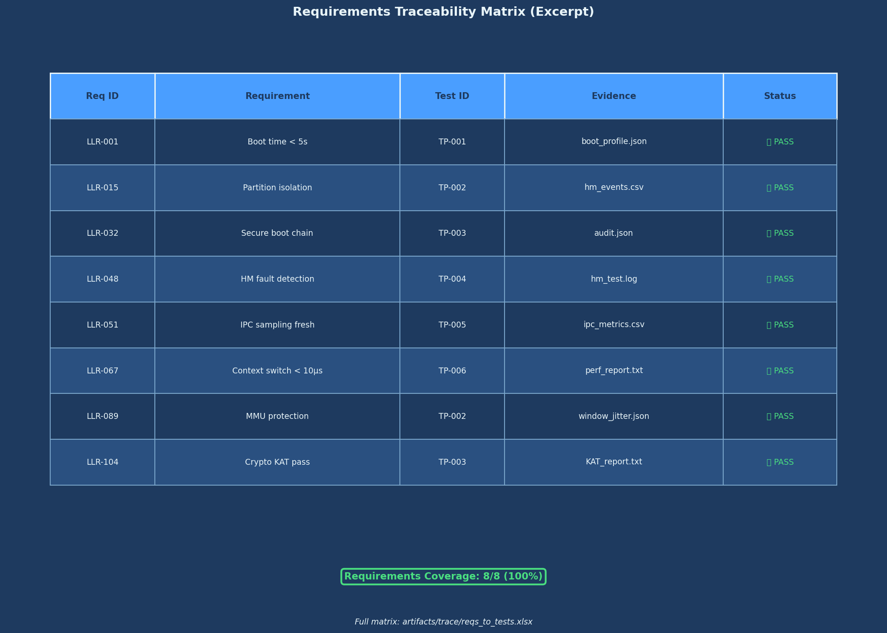
*Figure 12: Requirements traceability matrix excerpt showing requirement ID, test ID, evidence, and verification status*

---

## Anomalies & Problem Reports

- Problem Reports (PR) tracked in `../../evidence/DO-178C/lifecycle_data/problem_reports/`.  
- Each PR includes reproduction steps, suspected root cause, containment, fix, and regression tests.  
- Dispositions reflected in re-runs; non-conformances mapped to impacted requirements.

---

## Appendix A — Templates

**A.1 Test Procedure Template (Markdown)**

```markdown
# TP-XXX: <Title>
**Objective**: …
**Preconditions**: …
**Procedure**:
1) …
2) …
**Measurements**: <what/how/unit/tolerance>
**Pass Criteria**: <objective thresholds>
**Evidence**: <log paths, hashes>
**Notes**: <risks/assumptions>
````

**A.2 Test Case XML Snippet**

```xml
<TestCase id="TC-IPC-001" objective="Validate sampling freshness">
  <Preconditions>...</Preconditions>
  <Steps>
    <Step index="1">Configure sampling port ...</Step>
    <Step index="2">Publish pattern ...</Step>
  </Steps>
  <Measurements>
    <Metric name="age_ms" max="10"/>
  </Measurements>
  <PassCriteria>age_ms &lt;= 10</PassCriteria>
  <TraceRefs>
    <Req>LLR-IPC-SAMP-003</Req>
  </TraceRefs>
  <Artifacts>
    <File>logs/ipc/sampling_*.csv</File>
  </Artifacts>
</TestCase>
```

**A.3 Evidence Manifest (YAML)**

```yaml
artifact: "tr_os_boot_20240515.md"
sha256: "<hash>"
generated_by: "runner v1.5"
environment: "env_hw_cpiom_v2_1"
inputs:
  - "images/os_kernel.bin"
  - "configs/schedule.xml"
```

---

## Source Data Modules

* [DMC-Q100-A-42-30-00-00A-020A-P-EN-US.xml](../dmodule/DMC-Q100-A-42-30-00-00A-020A-P-EN-US.xml) — Integration Procedures
* [DMC-Q100-A-42-40-00-00A-020A-P-EN-US.xml](../dmodule/DMC-Q100-A-42-40-00-00A-020A-P-EN-US.xml) — Test Procedures

## Related Publications

* [General Manual](./PUB-A42-OS-GEN-00000-00.md)
* [Design Specification](./PUB-A42-OS-DES-00000-00.md)

## Related Resources

* [Test Environment Configuration](../../testing/test_results/test_environment.md)
* [DO-178C Verification Report](../../compliance/DO-178C_evidence/verification_report.md)
* [Tool Qualification Report (DO-330)](../../compliance/DO-330_evidence/tool_qualification_report.md)

---

**Document Control**

| Field            | Value                      |
| ---------------- | -------------------------- |
| Publication Code | PUB-A42-OS-TST-00000-00    |
| Version          | 1.1                        |
| Issue Date       | 2025-09-30                 |
| Maintainer       | IIS                        |
| Classification   | INTERNAL–EVIDENCE-REQUIRED |

```
::contentReference[oaicite:0]{index=0}
```

