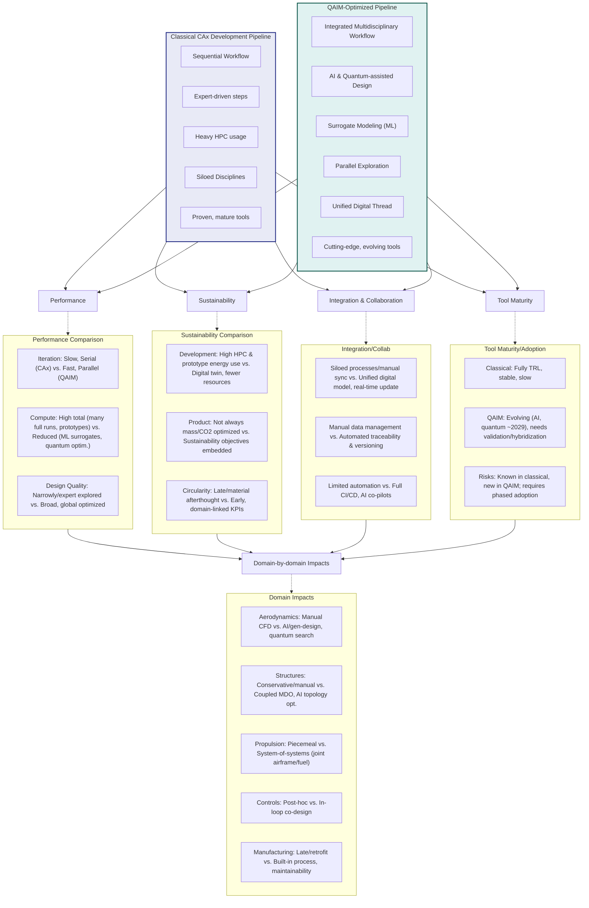
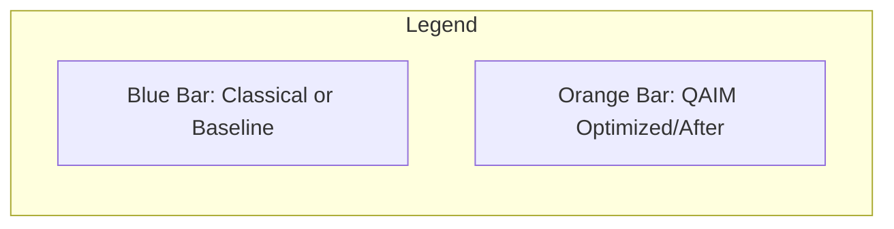
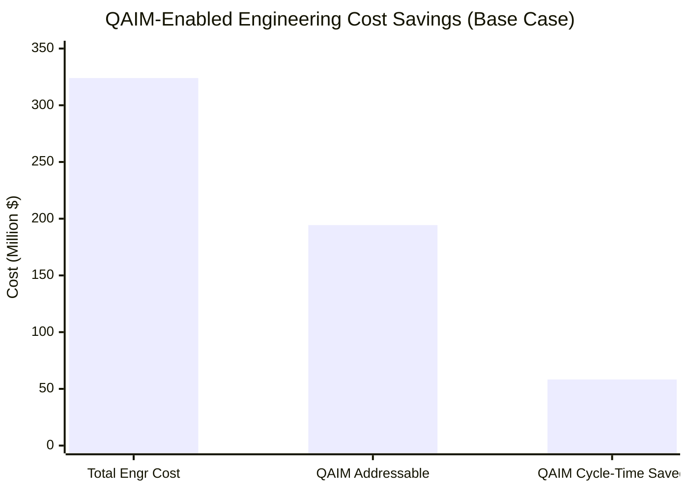
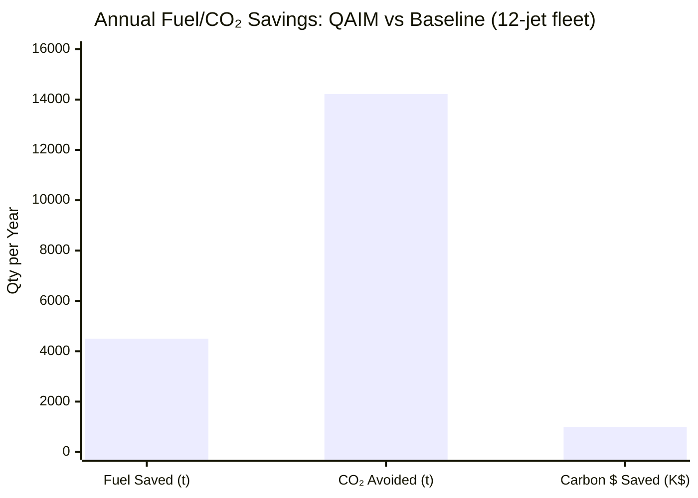

# BWB-Q100 — Transport Civil × Air

Blended Wing Body Q100 passenger aircraft under the ASI-T2 portfolio. This README is organized **Domain → Process (CAx/QOx) → ATA** for clean navigation and traceability.

---

## Quick Nav

* [Overview](#overview)
* [Directory Map (Domain → Process → ATA)](#directory-map-domain--process--ata)
* [Domain Index](#domain-index)
* [Domains ↔ Processes (CAx/QOx) ↔ ATA](#domains--processes-caxqox--ata)
* [QAIM-2: CAx → QOx Matrix (SIM)](#qaim-2-cax--qox-matrix-sim)
* [Workflows](#workflows)
  * [Detailed Quantum Optimization Process](#detailed-quantum-optimization-process)
  * [Domain-Specific Quantum Optimization Examples](#domain-specific-quantum-optimization-examples)
  * [Best Practices & Troubleshooting](#best-practices--troubleshooting)
* [Quantum Optimization Performance Metrics](#quantum-optimization-performance-metrics)
* [Evidence & Compliance](#evidence--compliance)
* [Glossary & Acronyms](#glossary--acronyms)
* [FAQ](#bwb-q100--faq)

---

## Overview

Target: \~100-passenger BWB optimized for fuel burn ↓, emissions ↓, noise ↓, and circularity ↑. Engineering follows TFA-ONLY path grammar, UIX.v1, and MAL-EEM ethics. Every milestone emits QS/UTCS evidence.

**Scope anchors**

* **Field:** Transport Civil
* **Environment:** Air
* **Lifecycle:** Domains decomposed into CAx processes with **QAIM-2** quantum augmentation (QOx)
* **Documentation:** ATA-aligned folders per domain

---

## Directory Map (Domain → Process → ATA)

```
Product_Line_AMPEL360/Model_BWB/variant-Q100/conf_000_baseline/MSN[0001-9999]
└── domains/
    ├── AAA/
    │   ├── cax/
    │   │   ├── CAD/
    │   │   ├── CAE/
    │   │   ├── CFD/
    │   │   ├── VP/
    │   │   └── PDM-PLM/
    │   ├── qox/
    │   │   ├── CAD/
    │   │   ├── CAE/
    │   │   └── CFD/
    │   └── ata/
    │       ├── ATA-20/
    │       ├── ATA-32/
    │       ├── ATA-51/
    │       ├── ATA-52/
    │       ├── ATA-53/
    │       ├── ATA-54/
    │       ├── ATA-55/
    │       ├── ATA-56/
    │       └── ATA-57/
    ├── AAP/
    │   ├── cax/
    │   │   ├── SCM/
    │   │   ├── MRP-ERP/
    │   │   ├── CIM/
    │   │   └── CAPP/
    │   ├── qox/
    │   │   ├── SCM/
    │   │   └── CIM/
    │   └── ata/
    │       ├── ATA-10/
    │       ├── ATA-12/
    │       ├── ATA-28/
    │       └── ATA-35/
    ├── CCC/
    │   ├── cax/
    │   │   ├── CAD/
    │   │   ├── CAE/
    │   │   ├── VP/
    │   │   └── PDM-PLM/
    │   ├── qox/
    │   │   ├── CAD/
    │   │   └── VP/
    │   └── ata/
    │       ├── ATA-11/
    │       ├── ATA-25/
    │       ├── ATA-31/
    │       ├── ATA-33/
    │       └── ATA-38/
    ├── CQH/
    │   ├── cax/
    │   │   ├── CAE/
    │   │   ├── CAI/
    │   │   ├── VP/
    │   │   └── CAT/
    │   ├── qox/
    │   │   ├── CAE/
    │   │   └── CAI/
    │   └── ata/
    │       ├── ATA-21/
    │       ├── ATA-26/
    │       ├── ATA-28/
    │       ├── ATA-36/
    │       └── ATA-47/
    ├── DDD/
    │   ├── cax/
    │   │   ├── CAI/
    │   │   ├── CASE/
    │   │   ├── KBE/
    │   │   └── PDM-PLM/
    │   ├── qox/
    │   │   ├── CAI/
    │   │   └── KBE/
    │   └── ata/
    │       ├── ATA-23/
    │       ├── ATA-31/
    │       ├── ATA-42/
    │       ├── ATA-45/
    │       └── ATA-46/
    ├── EDI/
    │   ├── cax/
    │   │   ├── CAI/
    │   │   ├── CASE/
    │   │   └── VP/
    │   ├── qox/
    │   │   ├── CAI/
    │   │   └── CASE/
    │   └── ata/
    │       ├── ATA-23/
    │       ├── ATA-31/
    │       ├── ATA-33/
    │       ├── ATA-34/
    │       ├── ATA-42/
    │       └── ATA-46/
    ├── EEE/
    │   ├── cax/
    │   │   ├── CAE/
    │   │   ├── CAD/
    │   │   ├── CAM/
    │   │   ├── PDM-PLM/
    │   │   └── CAI/
    │   ├── qox/
    │   │   ├── CAE/
    │   │   └── CAM/
    │   └── ata/
    │       ├── ATA-21/
    │       ├── ATA-24/
    │       └── ATA-30/
    ├── EER/
    │   ├── cax/
    │   │   ├── KBE/
    │   │   ├── VP/
    │   │   ├── CASE/
    │   │   └── PDM-PLM/
    │   ├── qox/
    │   │   └── KBE/
    │   └── ata/
    │       ├── ATA-21/
    │       ├── ATA-31/
    │       ├── ATA-38/
    │       └── ATA-78/
    ├── IIF/
    │   ├── cax/
    │   │   ├── CAPP/
    │   │   ├── CAM/
    │   │   ├── CIM/
    │   │   ├── MRP-ERP/
    │   │   └── CAA/
    │   ├── qox/
    │   │   ├── CAM/
    │   │   └── CIM/
    │   └── ata/
    │       ├── ATA-20/
    │       └── ATA-51/
    ├── IIS/
    │   ├── cax/
    │   │   ├── CAI/
    │   │   ├── CASE/
    │   │   └── KBE/
    │   ├── qox/
    │   │   ├── CAI/
    │   │   └── KBE/
    │   └── ata/
    │       ├── ATA-22/
    │       ├── ATA-42/
    │       ├── ATA-45/
    │       └── ATA-46/
    ├── LCC/
    │   ├── cax/
    │   │   ├── CAI/
    │   │   ├── VP/
    │   │   └── CASE/
    │   ├── qox/
    │   │   └── CAI/
    │   └── ata/
    │       ├── ATA-22/
    │       ├── ATA-23/
    │       ├── ATA-27/
    │       ├── ATA-34/
    │       └── ATA-46/
    ├── LIB/
    │   ├── cax/
    │   │   ├── SCM/
    │   │   ├── MRP-ERP/
    │   │   └── PDM-PLM/
    │   ├── qox/
    │   │   ├── SCM/
    │   │   └── MRP-ERP/
    │   └── ata/
    │       ├── ATA-20/
    │       ├── ATA-51/
    │       ├── ATA-52/
    │       ├── ATA-53/
    │       ├── ATA-54/
    │       ├── ATA-55/
    │       ├── ATA-56/
    │       ├── ATA-57/
    │       ├── ATA-70/
    │       ├── ATA-71/
    │       ├── ATA-72/
    │       ├── ATA-73/
    │       ├── ATA-74/
    │       ├── ATA-75/
    │       ├── ATA-76/
    │       ├── ATA-77/
    │       ├── ATA-78/
    │       └── ATA-79/
    ├── MEC/
    │   ├── cax/
    │   │   ├── CAD/
    │   │   ├── CAE/
    │   │   ├── CAM/
    │   │   ├── CAPP/
    │   │   └── VP/
    │   ├── qox/
    │   │   └── CAE/
    │   └── ata/
    │       ├── ATA-21/
    │       ├── ATA-27/
    │       ├── ATA-29/
    │       ├── ATA-30/
    │       ├── ATA-32/
    │       ├── ATA-35/
    │       ├── ATA-36/
    │       └── ATA-38/
    ├── OOO/
    │   ├── cax/
    │   │   ├── PDM-PLM/
    │   │   ├── CAI/
    │   │   ├── CASE/
    │   │   └── KBE/
    │   ├── qox/
    │   │   └── KBE/
    │   └── ata/
    │       ├── ATA-45/
    │       └── ATA-46/
    └── PPP/
        ├── cax/
        │   ├── CAD/
        │   ├── CAE/
        │   ├── CFD/
        │   ├── CAM/
        │   └── VP/
        ├── qox/
        │   ├── CAD/
        │   ├── CAE/
        │   └── CFD/
        └── ata/
            ├── ATA-28/
            ├── ATA-49/
            ├── ATA-70/
            ├── ATA-71/
            ├── ATA-72/
            ├── ATA-73/
            ├── ATA-74/
            ├── ATA-75/
            ├── ATA-76/
            ├── ATA-77/
            ├── ATA-78/
            └── ATA-79/
```

---

## Domain Index

* [AAA — Aerodynamics & Airframes](./domains/AAA/)
* [AAP — Airport Adaptable Platforms](./domains/AAP/)
* [CCC — Cockpit, Cabin & Cargo](./domains/CCC/)
* [CQH — Cryogenics, Quantum & H₂](./domains/CQH/)
* [DDD — Digital & Data Defense](./domains/DDD/)
* [EDI — Electronics & Digital Instruments](./domains/EDI/)
* [EEE — Ecological Efficient Electrification](./domains/EEE/)
* [EER — Environmental, Emissions & Remediation](./domains/EER/)
* [IIF — Industrial Infrastructure & Facilities](./domains/IIF/)
* [IIS — Integrated Intelligence & Software](./domains/IIS/)
* [LCC — Linkages, Control & Communications](./domains/LCC/)
* [LIB — Logistics, Inventory & Blockchain](./domains/LIB/)
* [MEC — Mechanical Systems Modules](./domains/MEC/)
* [OOO — OS, Ontologies & Office Interfaces](./domains/OOO/)
* [PPP — Propulsion & Fuel System](./domains/PPP/)

---

## Domains ↔ Processes (CAx/QOx) ↔ ATA

| Domain  | CAx (links)                                                                                                                                                             | QOx (links)                                                                                   | ATA docs (links)                                                                                                                                                                                                                                                                                                                                    |
| ------- | ----------------------------------------------------------------------------------------------------------------------------------------------------------------------- | --------------------------------------------------------------------------------------------- | --------------------------------------------------------------------------------------------------------------------------------------------------------------------------------------------------------------------------------------------------------------------------------------------------------------------------------------------------- |
| **AAA** | [CAD](./domains/AAA/cax/CAD/) · [CAE](./domains/AAA/cax/CAE/) · [CFD](./domains/AAA/cax/CFD/) · [VP](./domains/AAA/cax/VP/) · [PDM-PLM](./domains/AAA/cax/PDM-PLM/)     | [CAD](./domains/AAA/qox/CAD/) · [CAE](./domains/AAA/qox/CAE/) · [CFD](./domains/AAA/qox/CFD/) | [ATA-51](./domains/AAA/ata/ATA-51/) · [ATA-52](./domains/AAA/ata/ATA-52/) · [ATA-53](./domains/AAA/ata/ATA-53/) · [ATA-54](./domains/AAA/ata/ATA-54/) · [ATA-55](./domains/AAA/ata/ATA-55/) · [ATA-56](./domains/AAA/ata/ATA-56/) · [ATA-57](./domains/AAA/ata/ATA-57/) · [ATA-32](./domains/AAA/ata/ATA-32/) · [ATA-20](./domains/AAA/ata/ATA-20/) |
| **AAP** | [SCM](./domains/AAP/cax/SCM/) · [MRP-ERP](./domains/AAP/cax/MRP-ERP/) · [CIM](./domains/AAP/cax/CIM/) · [CAPP](./domains/AAP/cax/CAPP/)                                 | [SCM](./domains/AAP/qox/SCM/) · [CIM](./domains/AAP/qox/CIM/)                                 | [ATA-10](./domains/AAP/ata/ATA-10/) · [ATA-12](./domains/AAP/ata/ATA-12/) · [ATA-28](./domains/AAP/ata/ATA-28/) · [ATA-35](./domains/AAP/ata/ATA-35/)                                                                                                                                                                                               |
| **CCC** | [CAD](./domains/CCC/cax/CAD/) · [CAE](./domains/CCC/cax/CAE/) · [VP](./domains/CCC/cax/VP/) · [PDM-PLM](./domains/CCC/cax/PDM-PLM/)                                     | [CAD](./domains/CCC/qox/CAD/) · [VP](./domains/CCC/qox/VP/)                                   | [ATA-25](./domains/CCC/ata/ATA-25/) · [ATA-31](./domains/CCC/ata/ATA-31/) · [ATA-33](./domains/CCC/ata/ATA-33/) · [ATA-38](./domains/CCC/ata/ATA-38/) · [ATA-11](./domains/CCC/ata/ATA-11/)                                                                                                                                                         |
| **CQH** | [CAE](./domains/CQH/cax/CAE/) · [CAI](./domains/CQH/cax/CAI/) · [VP](./domains/CQH/cax/VP/) · [CAT](./domains/CQH/cax/CAT/)                                             | [CAE](./domains/CQH/qox/CAE/) · [CAI](./domains/CQH/qox/CAI/)                                 | [ATA-28](./domains/CQH/ata/ATA-28/) · [ATA-21](./domains/CQH/ata/ATA-21/) · [ATA-26](./domains/CQH/ata/ATA-26/) · [ATA-36](./domains/CQH/ata/ATA-36/) · [ATA-47](./domains/CQH/ata/ATA-47/)                                                                                                                                                         |
| **DDD** | [CAI](./domains/DDD/cax/CAI/) · [CASE](./domains/DDD/cax/CASE/) · [KBE](./domains/DDD/cax/KBE/) · [PDM-PLM](./domains/DDD/cax/PDM-PLM/)                                 | [CAI](./domains/DDD/qox/CAI/) · [KBE](./domains/DDD/qox/KBE/)                                 | [ATA-46](./domains/DDD/ata/ATA-46/) · [ATA-45](./domains/DDD/ata/ATA-45/) · [ATA-31](./domains/DDD/ata/ATA-31/) · [ATA-23](./domains/DDD/ata/ATA-23/) · [ATA-42](./domains/DDD/ata/ATA-42/)                                                                                                                                                         |
| **EDI** | [CAI](./domains/EDI/cax/CAI/) · [CASE](./domains/EDI/cax/CASE/) · [VP](./domains/EDI/cax/VP/)                                                                           | [CAI](./domains/EDI/qox/CAI/) · [CASE](./domains/EDI/qox/CASE/)                               | [ATA-31](./domains/EDI/ata/ATA-31/) · [ATA-23](./domains/EDI/ata/ATA-23/) · [ATA-34](./domains/EDI/ata/ATA-34/) · [ATA-46](./domains/EDI/ata/ATA-46/) · [ATA-42](./domains/EDI/ata/ATA-42/) · [ATA-33](./domains/EDI/ata/ATA-33/)                                                                                                                   |
| **EEE** | [CAE](./domains/EEE/cax/CAE/) · [CAD](./domains/EEE/cax/CAD/) · [CAM](./domains/EEE/cax/CAM/) · [PDM-PLM](./domains/EEE/cax/PDM-PLM/) · [CAI](./domains/EEE/cax/CAI/)   | [CAE](./domains/EEE/qox/CAE/) · [CAM](./domains/EEE/qox/CAM/)                                 | [ATA-24](./domains/EEE/ata/ATA-24/) · [ATA-21](./domains/EEE/ata/ATA-21/) · [ATA-30](./domains/EEE/ata/ATA-30/)                                                                                                                                                                                                                                     |
| **EER** | [KBE](./domains/EER/cax/KBE/) · [VP](./domains/EER/cax/VP/) · [CASE](./domains/EER/cax/CASE/) · [PDM-PLM](./domains/EER/cax/PDM-PLM/)                                   | [KBE](./domains/EER/qox/KBE/)                                                                 | [ATA-21](./domains/EER/ata/ATA-21/) · [ATA-31](./domains/EER/ata/ATA-31/) · [ATA-38](./domains/EER/ata/ATA-38/) · [ATA-78](./domains/EER/ata/ATA-78/)                                                                                                                                                                                               |
| **IIF** | [CAPP](./domains/IIF/cax/CAPP/) · [CAM](./domains/IIF/cax/CAM/) · [CIM](./domains/IIF/cax/CIM/) · [MRP-ERP](./domains/IIF/cax/MRP-ERP/) · [CAA](./domains/IIF/cax/CAA/) | [CAM](./domains/IIF/qox/CAM/) · [CIM](./domains/IIF/qox/CIM/)                                 | [ATA-20](./domains/IIF/ata/ATA-20/) · [ATA-51](./domains/IIF/ata/ATA-51/)                                                                                                                                                                                                                                                                           |
| **IIS** | [CAI](./domains/IIS/cax/CAI/) · [CASE](./domains/IIS/cax/CASE/) · [KBE](./domains/IIS/cax/KBE/)                                                                         | [CAI](./domains/IIS/qox/CAI/) · [KBE](./domains/IIS/qox/KBE/)                                 | [ATA-46](./domains/IIS/ata/ATA-46/) · [ATA-42](./domains/IIS/ata/ATA-42/) · [ATA-22](./domains/IIS/ata/ATA-22/) · [ATA-45](./domains/IIS/ata/ATA-45/)                                                                                                                                                                                               |
| **LCC** | [CAI](./domains/LCC/cax/CAI/) · [VP](./domains/LCC/cax/VP/) · [CASE](./domains/LCC/cax/CASE/)                                                                           | [CAI](./domains/LCC/qox/CAI/)                                                                 | [ATA-22](./domains/LCC/ata/ATA-22/) · [ATA-23](./domains/LCC/ata/ATA-23/) · [ATA-27](./domains/LCC/ata/ATA-27/) · [ATA-34](./domains/LCC/ata/ATA-34/) · [ATA-46](./domains/LCC/ata/ATA-46/)                                                                                                                                                         |
| **LIB** | [SCM](./domains/LIB/cax/SCM/) · [MRP-ERP](./domains/LIB/cax/MRP-ERP/) · [PDM-PLM](./domains/LIB/cax/PDM-PLM/)                                                           | [SCM](./domains/LIB/qox/SCM/) · [MRP-ERP](./domains/LIB/qox/MRP-ERP/)                         | [ATA-20](./domains/LIB/ata/ATA-20/) · 51–57 · 70–79                                                                                                                                                                                                                                                                                                 |
| **MEC** | [CAD](./domains/MEC/cax/CAD/) · [CAE](./domains/MEC/cax/CAE/) · [CAM](./domains/MEC/cax/CAM/) · [CAPP](./domains/MEC/cax/CAPP/) · [VP](./domains/MEC/cax/VP/)           | [CAE](./domains/MEC/qox/CAE/)                                                                 | [ATA-27](./domains/MEC/ata/ATA-27/) · [ATA-29](./domains/MEC/ata/ATA-29/) · [ATA-32](./domains/MEC/ata/ATA-32/) · [ATA-30](./domains/MEC/ata/ATA-30/) · [ATA-36](./domains/MEC/ata/ATA-36/) · [ATA-35](./domains/MEC/ata/ATA-35/) · [ATA-21](./domains/MEC/ata/ATA-21/) · [ATA-38](./domains/MEC/ata/ATA-38/)                                       |
| **OOO** | [PDM-PLM](./domains/OOO/cax/PDM-PLM/) · [CAI](./domains/OOO/cax/CAI/) · [CASE](./domains/OOO/cax/CASE/) · [KBE](./domains/OOO/cax/KBE/)                                 | [KBE](./domains/OOO/qox/KBE/)                                                                 | [ATA-46](./domains/OOO/ata/ATA-46/) · [ATA-45](./domains/OOO/ata/ATA-45/)                                                                                                                                                                                                                                                                           |
| **PPP** | [CAD](./domains/PPP/cax/CAD/) · [CAE](./domains/PPP/cax/CAE/) · [CFD](./domains/PPP/cax/CFD/) · [CAM](./domains/PPP/cax/CAM/) · [VP](./domains/PPP/cax/VP/)             | [CAD](./domains/PPP/qox/CAD/) · [CAE](./domains/PPP/qox/CAE/) · [CFD](./domains/PPP/qox/CFD/) | [ATA-70](./domains/PPP/ata/ATA-70/) · … · [ATA-79](./domains/PPP/ata/ATA-79/) · [ATA-28](./domains/PPP/ata/ATA-28/) · [ATA-49](./domains/PPP/ata/ATA-49/)                                                                                                                                                                                           |

---

## QAIM-2: CAx → QOx Matrix (SIM)

The Quantum-Accelerated Industry Model 2 (QAIM-2) provides strategic mapping from classical Computer-Aided (CAx) processes to Quantum-Optimized (QOx) implementations within the Sustainable Industry Model framework. This matrix identifies optimization targets, quantum formulations, sustainability levers, and technology maturity for BWB-Q100 development.

> **Reference**: Complete QAIM-2 framework available at [`FIELDS/cross/QAIM-2/`](../../../FIELDS/cross/QAIM-2/README.md) with detailed implementation strategies and 18 industrial domains.


*visual comparison between the Classical CAx Development Pipeline and the QAIM-Optimized Pipeline for the BWB H₂ project across four main criteria: Performance (Iteration speed, Compute workload, Design quality)
Sustainability (Energy/material use, End-product sustainability)
Integration/Collaboration (Domain integration, Automation, Data management)
Tool Maturity (Technology readiness, Risks, Adoption path)* [path_to_research](https://chatgpt.com/s/dr_68d173dae3a88191bed90e69a4cf219b)

```mermaid
xychart-beta
    title "CFD Compute Cost: Baseline vs QAIM-Optimized"
    x-axis ["Classical CAx", "QAIM (Surrogates)"]
    y-axis "Dev Phase CFD Cost ($K)" 0 --> 600
    bar [500]
    bar [250.5]
```

```mermaid
xychart-beta
    title "Test Campaign Cost (Dev Phase, All Scenarios)"
    x-axis ["Classical", "QAIM"]
    y-axis "Cost ($M)" 0 --> 50
    bar [40] %% Classical CAx
    bar [30] %% QAIM Optimized
```

```mermaid
xychart-beta
    title "Plant Annual Energy Cost (Ops Phase)"
    x-axis ["Baseline", "QAIM Energy Optimized"]
    y-axis "Plant Energy Cost ($M/yr)" 0 --> 12
    bar [10]
    bar [7.33]
```

```mermaid
xychart-beta
    title "Annual Logistics Cost: Baseline vs QAIM"
    x-axis ["Classical", "QAIM"]
    y-axis "Logistics Cost ($M/yr)" 0 --> 60
    bar [50]
    bar [45]
```

```mermaid
xychart-beta
    title "Annual Inventory Carrying Cost"
    x-axis ["Baseline", "QAIM"]
    y-axis "Carrying Cost ($M/yr)" 0 --> 18
    bar [16]
    bar [12]
```









**source data**

Here’s the table:

| Parameter                                           | Conservative | Base     | Aggressive |
|-----------------------------------------------------|--------------|----------|------------|
| Dev duration (years)                                | 4            | 4        | 4          |
| Ops horizon after dev (years)                       | 6            | 6        | 6          |
| Discount rate                                       | 0.1          | 0.1      | 0.1        |
| Engineers (avg)                                     | 250          | 300      | 350        |
| Fully-loaded eng. cost ($/hr)                       | 140          | 150      | 160        |
| Engineer hours/year                                 | 1800         | 1800     | 1800       |
| Fraction workload QAIM-improvable                   | 0.5          | 0.6      | 0.7        |
| Cycle-time reduction % (Conservative)               | 0.15         | 0.2      | 0.25       |
| Cycle-time reduction % (Base)                       | 0.2          | 0.3      | 0.4        |
| Cycle-time reduction % (Aggressive)                 | 0.3          | 0.4      | 0.5        |
| CFD runs (baseline, dev phase total)                | 1500         | 2000     | 2500       |
| Core-hours per CFD run                              | 4000         | 5000     | 6000       |
| HPC cost per core-hour ($)                          | 0.05         | 0.05     | 0.05       |
| Fraction runs replaced by surrogate/DOE             | 0.4          | 0.5      | 0.6        |
| Surrogate/DOE speedup factor                        | 200          | 500      | 1000       |
| Plant energy cost baseline ($/yr during ops)        | 8,000,000    | 10,000,000 | 12,000,000 |
| Manufacturing energy reduction % (QAIM)             | 0.18         | 0.267    | 0.3        |
| Annual logistics cost baseline ($/yr ops)           | 40,000,000   | 50,000,000 | 60,000,000 |
| Logistics cost reduction % (QAIM)                   | 0.08         | 0.1      | 0.12       |
| Inventory value baseline ($)                        | 60,000,000   | 80,000,000 | 100,000,000|
| Carrying cost %/yr                                  | 0.2          | 0.2      | 0.2        |
| Inventory reduction % (QAIM)                        | 0.1          | 0.15     | 0.2        |
| Test cases (count, dev)                             | 1500         | 2000     | 2500       |
| Cost per test ($)                                   | 15,000       | 20,000   | 25,000     |
| Test reduction % (QAIM)                             | 0.2          | 0.25     | 0.3        |
| Annual rework/scrap cost (dev+ops) ($)              | 6,000,000    | 8,000,000 | 10,000,000 |
| Rework reduction % (QAIM)                           | 0.12         | 0.15     | 0.18       |
| Per-aircraft yearly flights (ops)                   | 2500         | 3000     | 3500       |
| Fuel burn baseline per flight (tonnes)              | 2            | 2.5      | 3          |
| Fuel price ($/tonne)                                | 900          | 900      | 900        |
| Fleet size entering ops                             | 10           | 12       | 15         |
| Fuel burn reduction % via design weight/aero (QAIM) | 0.03         | 0.05     | 0.07       |
| CO2 per tonne fuel (tonnes)                         | 3.16         | 3.16     | 3.16       |
| Carbon price ($/tonne CO2)                          | 70           | 70       | 100        |
| Quantum compute cost ($/yr dev)                     | 600,000      | 900,000  | 1,300,000  |
| Platform licenses/support ($/yr dev+ops)            | 400,000      | 500,000  | 700,000    |
| One-off integration/setup ($)                       | 1,500,000    | 2,000,000 | 2,500,000  |
| Training/change mgmt one-off ($)                    | 800,000      | 1,000,000 | 1,200,000  |


### BWB-Q100 Optimization Matrix

*(i)* optimization target · *(ii)* quantum mapping · *(iii)* SIM lever · *(iv)* maturity

| CAx domain | (i) What to optimize            | (ii) Quantum mapping                       | (iii) SIM lever                  | (iv) Maturity  |
| ---------- | ------------------------------- | ------------------------------------------ | -------------------------------- | -------------- |
| **CAD**    | Layout/topology                 | QUBO/BQM → QAOA/Annealing; VQE subproblems | Material use ↓; drag ↓           | Pilot/Research |
| **CAE**    | Topology & sizing               | QUBO/BQM; exploratory QLSA/HHL             | Mass ↓ with safety ↑             | Research       |
| **CFD**    | Operating points; DOE           | QUBO for DOE; exploratory QLSA/HHL         | Fuel burn ↓; emissions ↓         | Research       |
| **KBE**    | Rule Max-SAT                    | QUBO Max-SAT → QAOA/Annealing              | Right-first-time ↑               | Pilot          |
| **VP**     | Test plan selection             | QUBO/BQM → QAOA/Annealing                  | Test time/energy ↓               | Pilot          |
| **CAM**    | Toolpath batch, sequencing      | QUBO/BQM (job/flow shop)                   | Energy/idle ↓; throughput ↑      | Pilot          |
| **CAPP**   | Routing; takt balance           | QUBO/BQM                                   | WIP ↓; takt adherence ↑          | Pilot          |
| **MRP-ERP**| Inventory/capacity/lot sizing   | Multi-objective QUBO (hybrid)              | Stockouts/waste ↓; service ↑     | Pilot          |
| **CIM**    | Plant meta-schedule             | Global schedule QUBO                       | Energy/CO₂ per unit ↓            | Pilot          |
| **SCM**    | VRP/mVRP/network                | Routing QUBO → Annealing/QAOA (hybrid)     | Transport emissions ↓; OTIF ↑    | Now/Pilot      |
| **PDM-PLM**| BOM variants; change impact     | QUBO/BQM                                   | Rework ↓; circularity ↑          | Pilot          |
| **CAI**    | Embedding portfolio (multi-obj) | Weighted-objective QUBO → QAOA             | Energy efficiency ↑; abatement ↑ | Pilot          |
| **CAA**    | Robot/cell allocation & timing  | Assignment/scheduling QUBO                 | Utilization ↑; energy ↓          | Pilot          |


### Implementation Strategy by Maturity Level

#### Phase 1: Now/Pilot Deployment (Ready for immediate implementation)
- **SCM Optimization**: Vehicle routing, supply network design using quantum annealing
- **Production Scheduling**: CAPP routing optimization, takt time balancing
- **Resource Allocation**: CAA robot scheduling, facility utilization optimization

#### Phase 2: Pilot Programs (Near-term quantum systems)
- **Design Optimization**: CAD topology optimization, materials selection via VQE
- **Manufacturing Efficiency**: CAM toolpath optimization, CIM plant scheduling
- **Knowledge Systems**: KBE rule satisfaction, VP test plan optimization
- **Inventory Management**: MRP-ERP multi-echelon optimization

#### Phase 3: Research & Development (Future quantum capabilities)
- **Advanced Simulation**: CFD operating point optimization via HHL/QLSA
- **Structural Analysis**: CAE topology/sizing with quantum linear solvers
- **Multi-physics**: Coupled fluid-structure-thermal optimization

### Quantum Hardware Requirements

#### Current Generation (2024-2026)
- **Quantum Annealers**: 5000+ qubits for SCM, CAPP, scheduling problems
- **Gate-based Systems**: 100-1000 qubits for QAOA applications
- **Classical Hybrid**: CPU/GPU clusters for pre/post-processing

#### Near-term (2026-2030)
- **Error-corrected Systems**: 1000+ logical qubits for VQE applications
- **Photonic Processors**: Specialized for optimization and machine learning
- **Distributed Quantum**: Multi-node quantum networks for large problems

#### Long-term (2030+)
- **Fault-tolerant Systems**: 10,000+ logical qubits for HHL/QLSA
- **Application-specific**: Domain-optimized quantum processors
- **Quantum-classical Integration**: Seamless hybrid computing platforms

### Domain-Specific Quantum Optimization Examples

#### AAA (Aerodynamics & Airframes) - Wing Design Optimization
**Classical Problem**: Optimize wing geometry for minimum drag while maintaining structural integrity
```
Input: Wing geometry parameters (30-100 variables)
Constraints: Lift requirements, structural limits, manufacturing feasibility
Objective: Minimize drag coefficient + weight penalty
```

**Quantum Approach**:
1. **CAD Phase**: Parametric wing model with discrete topology choices
2. **QOx Encoding**: QUBO formulation with drag/weight objectives
3. **Quantum Solve**: QAOA with p=3 layers, 500 parameters
4. **Post-processing**: Classical refinement of continuous parameters
5. **Expected Benefit**: 5-15% drag reduction, 20% faster optimization

**File Structure**:
```
domains/AAA/cax/CAD/wing_optimization_baseline/
domains/AAA/qox/CAD/problems/wing_topology_v1.json
domains/AAA/qox/CAD/runs/20250122-143052/
domains/AAA/ata/ATA-57/wing_quantum_optimization.md
```

#### PPP (Propulsion) - Engine Operating Point Optimization
**Classical Problem**: Find optimal engine operating conditions across flight envelope
```
Input: Throttle settings, inlet conditions, flight phases (50-200 variables)
Constraints: Temperature limits, surge margins, emissions regulations
Objective: Minimize fuel consumption + emissions weighted sum
```

**Quantum Approach**:
1. **CFD Phase**: High-fidelity engine simulations at discrete operating points
2. **QOx Encoding**: DOE selection as QUBO, operating point optimization
3. **Quantum Solve**: Quantum annealing for DOE + QAOA for continuous optimization
4. **SIM Integration**: Real-time fuel/emissions tracking
5. **Expected Benefit**: 8-12% fuel savings, 15% reduction in emissions

#### MEC (Mechanical Systems) - Landing Gear Topology Optimization
**Classical Problem**: Optimize landing gear structure for minimum weight with safety margins
```
Input: Load paths, material distribution, joint locations (100-500 variables)
Constraints: Ultimate load factors, fatigue life, ground clearance
Objective: Minimize structural weight while maximizing safety margin
```

**Quantum Approach**:
1. **CAE Phase**: FEA topology optimization with discrete element choices
2. **QOx Encoding**: Binary material distribution QUBO with stress constraints
3. **Quantum Solve**: VQE for materials properties + QAOA for topology
4. **Validation**: Classical FEA verification of quantum solutions
5. **Expected Benefit**: 10-20% weight reduction, faster design iterations

### Best Practices & Troubleshooting

#### Problem Formulation Guidelines
1. **Variable Reduction**: Use dimensionality reduction before quantum encoding
2. **Constraint Handling**: Prefer penalty methods over Lagrange multipliers
3. **Objective Scaling**: Normalize objectives to similar magnitude ranges
4. **Decomposition**: Split large problems into quantum-amenable subproblems

#### Performance Optimization
- **Parameter Tuning**: Use Bayesian optimization for variational parameters
- **Error Mitigation**: Apply zero-noise extrapolation for NISQ devices
- **Classical Post-processing**: Combine quantum samples with local search
- **Benchmarking**: Always compare against best classical algorithms

#### Common Issues & Solutions
| Issue | Symptoms | Solution |
|-------|----------|----------|
| Poor solution quality | Low energy, constraint violations | Increase penalty weights, improve problem formulation |
| Slow convergence | High variance in results | Increase sampling shots, use better initial parameters |
| Scaling problems | Exponential resource growth | Problem decomposition, hybrid algorithms |
| Hardware limitations | Limited qubit connectivity | Graph embedding optimization, layout-aware formulation |

---

## Workflows

### High-Level Process Flow

1. **Model (CAx)** → commit in `domains/<CODE>/cax/<PHASE>/`.
2. **Encode (QOx)** → emit QUBO/BQM into `domains/<CODE>/qox/<PHASE>/problems/`.
3. **Solve** → run `qaoa/` or `annealing/`; save to `domains/<CODE>/qox/<PHASE>/runs/<YYYYMMDD-HHMMSS>/` (auto-QS/UTCS).
4. **Document (ATA)** → update `domains/<CODE>/ata/ATA-XX/` with references and evidence.
5. **Gate** → PR includes UTCS anchors; MAL-EEM enforced.

### Detailed Quantum Optimization Process

#### 1. Classical Modeling & Problem Identification (CAx)
An engineer performs standard engineering tasks using classical tools:
- **CAD**: Design component geometry, topology optimization, material selection
- **CAE**: Structural analysis, thermal simulations, safety margin calculations  
- **CFD**: Airflow analysis, drag/lift optimization, operating point studies
- **Manufacturing**: Process planning, toolpath generation, scheduling constraints

**Key Output**: Engineering problem with identified optimization opportunities that exceed classical computational limits.

#### 2. Quantum Problem Encoding (QOx)
Transform the classical optimization problem into quantum-compatible formulations:

**2.1 Problem Analysis**
- Identify decision variables (binary/discrete choices)
- Define objective function (minimize drag, cost, energy, etc.)
- Map constraints (safety, regulatory, physical limits)
- Assess problem complexity (variable count, constraint interactions)

**2.2 Mathematical Encoding**
- **QUBO Formulation**: Convert to Quadratic Unconstrained Binary Optimization

  $$
  \text{minimize:} \quad \mathbf{x}^\mathrm{T} Q \mathbf{x} + \mathbf{c}^\mathrm{T} \mathbf{x}
  $$
  $$
  \text{where} \quad \mathbf{x} \in \{0,1\}^n
  $$
- **BQM Structure**: Define binary quadratic model with bias and coupling terms
- **Penalty Methods**: Incorporate constraints via penalty functions
- **Multi-objective**: Weight sustainability objectives (fuel ↓, emissions ↓, mass ↓)

**2.3 Problem Validation**
- Verify QUBO matrix properties (symmetry, conditioning)
- Test small instances with classical solvers
- Validate constraint satisfaction in solution space

#### 3. Quantum Algorithm Selection & Execution
Choose optimal quantum approach based on problem characteristics:

**3.1 Algorithm Selection Matrix**
| Problem Type | Variables | Quantum Method | Hardware | Maturity |
|--------------|-----------|----------------|----------|----------|
| Routing/Scheduling | 100-1000 | QAOA + Classical | Gate-based | Pilot |
| Layout/Topology | 50-500 | Quantum Annealing | Annealer | Now |
| Materials/Chemistry | 10-100 | VQE | Gate-based | Research |
| Large Linear Systems | 1000+ | HHL/QLSA | Future | Research |

**3.2 Quantum Execution**
- **Parameter Optimization**: Tune variational parameters (QAOA angles, annealing schedule)
- **Noise Mitigation**: Apply error mitigation techniques for NISQ devices
- **Hybrid Processing**: Combine quantum and classical post-processing
- **Multi-shot Sampling**: Statistical analysis of quantum solutions

**3.3 Solution Validation**
- Classical verification of constraint satisfaction
- Performance benchmarking vs. classical methods
- Sustainability impact quantification (SIM levers)

#### 4. Documentation & Traceability (ATA)
Comprehensive documentation following aerospace standards:
- **Evidence Package**: QS/UTCS hashes, run parameters, solution quality metrics
- **ATA Integration**: Link to relevant aircraft system documentation
- **Sustainability Metrics**: LCA impact, GHG reduction, circularity improvement
- **Certification Trail**: MAL-EEM compliance, safety validation

#### 5. Quality Gates & Integration
- **Technical Review**: Solution quality, constraint satisfaction, performance gains
- **Ethics Validation**: MAL-EEM safety checks, bias detection, fairness assessment
- **Sustainability Assessment**: SIM lever effectiveness, environmental impact
- **Integration Testing**: Compatibility with downstream processes

---

## Quantum Optimization Performance Metrics

### Key Performance Indicators (KPIs)

#### Technical Performance
- **Solution Quality**: Energy gap from optimal (< 5% for pilot applications)
- **Convergence Rate**: Iterations to 95% of best solution (target: <100 iterations)
- **Success Probability**: Fraction of runs achieving target quality (>80%)
- **Scalability**: Maximum problem size tractable (variables handled)
- **Time-to-Solution**: Wall-clock time including classical pre/post processing

#### Sustainability Impact (SIM Levers)
- **Fuel Efficiency**: Percentage improvement in fuel burn (target: 5-15%)
- **Emissions Reduction**: CO₂, NOx reduction compared to baseline (target: 10-20%)
- **Material Efficiency**: Weight reduction, material waste minimization (target: 5-25%)
- **Energy Consumption**: Manufacturing/operational energy reduction (target: 10-30%)
- **Lifecycle Impact**: Cradle-to-grave environmental improvement (LCA metrics)

#### Business Metrics
- **Development Time**: Design iteration cycle reduction (target: 20-50%)
- **Cost Reduction**: Total ownership cost improvement (target: 5-15%)
- **Quality Improvement**: Defect reduction, right-first-time increase (target: 10-40%)
- **Innovation Velocity**: New design concepts explored per time unit

### Quantum Algorithm Benchmarks

#### QAOA Performance Targets
```
Problem Size: 100 variables
Circuit Depth: p=3 (target)
Success Rate: >70% achieving <10% optimality gap
Resource Usage: <1000 qubits, <10 minutes runtime
Application: Wing topology, manufacturing scheduling
```

#### Quantum Annealing Performance Targets
```
Problem Size: 1000-5000 variables
Annealing Time: 1-100 μs
Success Rate: >60% achieving <15% optimality gap
Resource Usage: 5000+ qubit annealer, <1 minute total
Application: Supply chain, facility layout, routing
```

#### VQE Performance Targets
```
Problem Size: 10-100 qubits (molecular systems)
Circuit Depth: 100-1000 gates
Chemical Accuracy: 1 kcal/mol (target)
Resource Usage: <200 qubits, fault-tolerant preferred
Application: Materials design, catalyst optimization
```

### Monitoring & Continuous Improvement

#### Real-time Monitoring
- **Quantum Device Performance**: Error rates, coherence times, gate fidelities
- **Solution Quality Trends**: Track improvement over time per domain
- **Resource Utilization**: Quantum processor usage efficiency
- **Integration Success**: CAx workflow integration metrics

#### Continuous Optimization
1. **Parameter Learning**: Bayesian optimization of variational parameters
2. **Problem Decomposition**: Adaptive subproblem identification
3. **Hardware Matching**: Optimal algorithm-hardware pairing
4. **Classical Integration**: Hybrid algorithm performance tuning

#### Quarterly Review Process
- **Performance Assessment**: Compare actual vs. target KPIs
- **Technology Roadmap**: Update quantum hardware adoption timeline
- **Domain Prioritization**: Focus resources on highest-impact applications
- **Training & Skills**: Quantum algorithm expertise development

---

## Evidence & Compliance

* UTCS/QS: deterministic evidence (hashes, operator, policy/model/data) per run.
* Ethics: MAL-EEM guard active across all agents.
* Standards: ATA folders carry the authoritative documentation for audits.

---

### Glossary & Acronyms

#### Domains

* **AAA — Aerodynamics & Airframes Architectures**
* **AAP — Airport Adaptable Platforms**
* **CCC — Cockpit, Cabin & Cargo**
* **CQH — Cryogenics, Quantum & H₂**
* **DDD — Digital & Data Defense**
* **EDI — Electronics & Digital Instruments**
* **EEE — Ecological Efficient Electrification**
* **EER — Environmental, Emissions & Remediation**
* **IIF — Industrial Infrastructure & Facilities**
* **IIS — Integrated Intelligence & Software**
* **LCC — Linkages, Control & Communications**
* **LIB — Logistics, Inventory & Blockchain**
* **MEC — Mechanical Systems Modules**
* **OOO — OS, Ontologies & Office Interfaces**
* **PPP — Propulsion & Fuel System**

#### Core architecture & governance

* **ASI-T2** — Artificial Super Intelligence Transponders for Aerospace Sustainable Industry Transition.
* **BWB** — Blended Wing Body (integrated wing–fuselage airframe).
* **TFA** — **Top Federation Algorithm / Threading Final Assembly**; federated architecture and execution thread tying all layers (Systems→States) into a single, auditable final-assembly flow (design → manufacture → integration → test → certification).
* **UTCS / QS** — Universal Traceability & Configuration System / Quantum Seal; deterministic provenance anchors and immutable evidence blobs.
* **UIX** — Universal Injection Prompt; mandatory pre-flight rules for human/AI agents.
* **MAL-EEM** — Ethics & Empathy Module; safety/ethical guardrails (fail-closed).

#### CAx terms (Computer-Aided *x*)

* **CAD — Computer-Aided Design**: geometry/topology, layouts, parametric models, BoMs; manufacturing definitions.
* **CAE — Computer-Aided Engineering**: structural/thermal/dynamic analyses (FEA, **MBD**), sizing & safety margins.
* **CFD — Computational Fluid Dynamics**: external/internal flows, aero/thermal performance, drag/noise trades, mesh & **DOE** strategies.
* **CAM — Computer-Aided Manufacturing**: toolpaths, NC programs, fixturing, machining strategies, additive build files.
* **CAPP — Computer-Aided Process Planning**: routing, work instructions, takt/line balance, station sequencing, process **FMEA**s.
* **VP — Virtual Prototyping**: system-level sims (**SIL/HIL**), campaign design, digital test plans prior to physical builds.
* **PDM-PLM — Product/Process Data & Lifecycle Management**: configuration control, variants, change impact, digital thread.
* **SCM — Supply Chain Management**: sourcing, logistics networks, supplier risk, material passports, **OTIF** performance.
* **MRP-ERP — Materials/Enterprise Resource Planning**: demand/capacity/lot sizing, inventory policies, cost & lead-time control.
* **CIM — Computer-Integrated Manufacturing**: plant-level orchestration, schedule optimization, energy/CO₂ per-unit tracking.
* **CAI — HW·SW·AI Embedding**: integration of electronics/software/AI with hardware (avionics, controls, autonomy).
* **CAA — Computer-Aided Automation**: robots/cells/**AGV**s scheduling, path/time optimization, safe automation envelopes.
* **CASE — Computer-Aided Software Engineering**: requirements↔tests traceability, test selection/triage, coverage metrics.
* **KBE / KLM — Knowledge-Based Engineering / Knowledge Lifecycle Management**: design rules, certification constraints, reusable logic.
* **CAT — Computer-Aided Testing**: environmental/functional/safety test execution and results curation (bench, rig, flight).

#### QOx terms (Quantum-Optimized *x* — per-phase quantum counterparts)

* **QOx/CAD** — Layout/topology encodings; **QUBO**/**BQM** → **QAOA**/annealing; materials sub-problems via **VQE**.
* **QOx/CAE** — Topology/sizing trade encodings; **QUBO/BQM** today, exploratory linear/PDE sub-solves via **HHL/QLSA**.
* **QOx/CFD** — **DOE** & operating-point selection as **QUBO**; long-term linear solves via **HHL/QLSA** research.
* **QOx/CAM** — Job/flow-shop batching & sequencing; **QUBO/BQM → QAOA/annealing** with hybrid post-processing.
* **QOx/CAPP** — Routing/takt/line-balance encodings; **QUBO/BQM** solved with variational/annealing hybrids.
* **QOx/VP** — Test-campaign/**DOE** selection; **QUBO/BQM** with explainable trade outputs to **SIM/LCA**.
* **QOx/PDM-PLM** — Variant/change-impact minimization; multi-objective **QUBO/BQM** portfolios.
* **QOx/SCM** — **VRP/mVRP**/network design; **QUBO/BQM →** annealing/**QAOA** plus classical heuristics.
* **QOx/MRP-ERP** — Inventory/capacity/lot sizing; multi-objective **QUBO/BQM** with hybrid decomposition.
* **QOx/CIM** — Plant meta-schedule/global orchestration; large-scale **QUBO/BQM** with hierarchical solves.
* **QOx/CAI** — Architecture/feature portfolio & controller tuning; weighted-objective **QUBO/BQM → QAOA**.
* **QOx/CAA** — Robot/cell assignment & timing; **QUBO/BQM** for resource-constrained scheduling.
* **QOx/CASE** — Test-set minimization/triage (coverage vs. risk); **QUBO/BQM → QAOA/annealing**.
* **QOx/KBE** — Rule/constraint satisfaction (**Max-SAT**); **QUBO** Max-SAT → **QAOA**/annealing.
* **QOx/CAT** — Test-sequence optimization & sensor selection; **QUBO/BQM** with reliability/**ESG** weighting.

#### Quantum & optimization methods

* **QUBO — Quadratic Unconstrained Binary Optimization**: binary decision vector with quadratic cost; standard encoding for routing, assignment, scheduling.
* **BQM — Binary Quadratic Model**: general form (binary or spin) equivalent to QUBO/Ising with pairwise interactions.
* **Ising Model** — Spin-based energy formulation equivalent to BQM; native to annealers.
* **QAOA — Quantum Approximate Optimization Algorithm**: variational, gate-model heuristic for combinatorial problems.
* **Quantum Annealing** — Energy-landscape minimization on Ising/BQM Hamiltonians (physical/analog or simulated).
* **VQE — Variational Quantum Eigensolver**: approximate ground states for chemistry/materials/physics sub-problems.
* **HHL / QLSA** — Quantum linear-system solvers; future-leaning for PDE/CFD/CAE kernels.
* **Max-SAT — Maximum Satisfiability**: optimization variant of SAT; maximize satisfied clauses under constraints.
* **DOE — Design of Experiments**: active selection of experiments/sim points (e.g., fractional factorial, Latin hypercube, Bayesian DOE).

#### Sustainability & operations

* **SIM — Sustainable Industry Model**: decision framework where CAx/QOx outcomes feed sustainability levers and KPIs.
* **LCA — Life Cycle Assessment**: ISO 14040/44 cradle-to-grave impact accounting (materials, manufacturing, use, EoL).
* **GHG Protocol** — Corporate greenhouse-gas accounting across **Scopes 1/2/3** (direct, energy, value-chain).
* **OTIF — On-Time In-Full**: supply-chain service KPI.
* **FMEA — Failure Modes & Effects Analysis**: risk assessment for process/product.
* **SIL / HIL — Software/Hardware-in-the-Loop**: closed-loop simulation with real code/hardware.
* **MBD — Multi-Body Dynamics**: dynamic simulation of interconnected rigid/flexible bodies.
* **BOM — Bill of Materials**: structured parts list for a configuration.
* **AGV — Automated Guided Vehicle**: mobile platform for intralogistics/assembly.
* **APU — Auxiliary Power Unit**: on-board power/air source (ATA-49).

## BWB-Q100 — FAQ 

**Q1. What’s the mission of BWB-Q100?**
A \~100-passenger blended-wing-body optimized for **fuel burn ↓, emissions ↓, noise ↓, circularity ↑**. Work follows **TFA** (Top Federation Algorithm / Threading Final Assembly), **UIX.v1**, and **MAL-EEM**, with QS/UTCS provenance at every gate.

**Q2. Where do I work for a given topic?**
Navigate **Domain → Process (CAx/QOx) → ATA** under:
`domains/<CODE>/{cax|qox}/<PHASE>/…` and `domains/<CODE>/ata/ATA-XX/…`.
Examples:

* Wing CFD: `domains/AAA/cax/CFD/` → quantum DOE in `domains/AAA/qox/CFD/` → docs in `domains/AAA/ata/ATA-57/`.
* Landing gear: `domains/MEC/…` and docs in `domains/MEC/ata/ATA-32/`.

**Q3. How do I add a new CAx study?**
Create a folder in the owning domain: `domains/<CODE>/cax/<PHASE>/…` with a short `README.md`, inputs, configs, and results. Commit with UTCS anchors.

**Q4. How do I produce a QOx run from a CAx study?**
Encode the decision as **QUBO/BQM**:
`domains/<CODE>/qox/<PHASE>/problems/<slug>.json`
Solve with `qaoa/` or `annealing/`; outputs go to:
`domains/<CODE>/qox/<PHASE>/runs/<YYYYMMDD-HHMMSS>/`
Each run emits QS/UTCS (policy/model/data/operator hashes).

**Q5. Where do ATA documents live and how do I link evidence?**
Per domain in `domains/<CODE>/ata/ATA-XX/`. Reference CAx/QOx artefacts by relative links and include their QS/UTCS digests in the doc’s evidence section.

**Q6. What if my work spans multiple domains?**
Put **primary ownership** in the most responsible domain (e.g., propulsion in **PPP**). Cross-link secondary impacts from their ATA folders (e.g., nacelle structures in **AAA/ATA-54**).

**Q7. How do revisions work (HOV)?**
Baseline lives in the product root. For **rev ≥ 1**, create:
`_revisions/REV_<LETTER>/HOV_<MSN_RANGE>_<PHASES>/…` mirroring the same domain/process/ATA structure. Keep filenames stable (no letters); encode rev in the path.

**Q8. Where do SIM/LCA results go?**
Attach **SIM** metrics (LCA per ISO 14040/44, GHG Scopes 1/2/3) alongside each QOx run:
`domains/<CODE>/qox/<PHASE>/runs/<ts>/sim_lca/` and cite in ATA docs.

**Q9. What’s the minimal PR that passes gates?**

* New/updated CAx content with short README.
* Matching QOx problem (if applicable) and at least one run.
* QS/UTCS evidence blobs for the run(s).
* Updated ATA doc with links & hashes.
* Title/labels per styleguide; MAL-EEM must pass.

**Q10. Quick map for common systems**

* **Autoflight (ATA-22):** `domains/LCC` (controls) / `domains/IIS` (software).
* **Information Systems (ATA-46):** `domains/DDD` and `domains/IIS`.
* **Electrical Power (ATA-24):** `domains/EEE`.
* **Fuel/H₂ (ATA-28):** `domains/PPP` (on-board) and `domains/AAP` (ground).
* **Structures (ATA-51–57):** `domains/AAA` (airframe), `domains/MEC` (mech modules).

**Q11. Which quantum method should I pick?**

**Decision Matrix**:
- **Routing/scheduling/layout**: QUBO/BQM → **Annealing/QAOA** (100-5000 variables)
- **Materials/chemistry**: **VQE** (10-100 qubits, molecular simulations)
- **Large linear/PDE kernels**: **HHL/QLSA** (exploratory, requires fault tolerance)
- **Combinatorial optimization**: **QAOA** (discrete choices, <1000 qubits)
- **Constraint satisfaction**: **QUBO Max-SAT** → **Annealing** (rule-based systems)

**Selection Criteria**:
1. **Problem Size**: Match qubit requirements to available hardware
2. **Problem Type**: Discrete → Annealing/QAOA, Continuous → VQE/HHL
3. **Accuracy Requirements**: High precision → VQE, Approximate → QAOA
4. **Time Constraints**: Fast results → Annealing, Quality → QAOA
5. **Connectivity**: High → Annealing, Low → Gate-based

**Q12. How do I validate quantum results?**

**Validation Pipeline**:
1. **Classical Verification**: Solve small instances classically for comparison
2. **Constraint Checking**: Verify all problem constraints are satisfied
3. **Statistical Analysis**: Multiple quantum runs, confidence intervals
4. **Benchmarking**: Compare against best known classical algorithms
5. **Physical Validation**: Test solutions in CAx tools (CAD, CAE, CFD)
6. **SIM Impact**: Measure sustainability improvements (fuel, emissions, etc.)

**Quality Metrics**:
- **Solution Quality**: Energy gap from ground state
- **Constraint Satisfaction**: Penalty function values
- **Convergence**: Variance across multiple runs
- **Performance Ratio**: Quantum vs. classical solution quality
- **Resource Efficiency**: Time-to-solution, energy consumption

**Q13. Where do I put compliance & safety test artefacts?**
Under the **owning CAx phase** (`cax/CAT`, `cax/VP`, etc.) with links to the relevant **ATA** chapter folder; mirror any optimization in `qox/<PHASE>/…` and attach QS/UTCS.

**Q14. How do I troubleshoot poor quantum performance?**

**Diagnostic Checklist**:
1. **Problem Formulation**:
   - Check QUBO matrix conditioning (eigenvalue spread <1000)
   - Verify constraint penalty weights (10x-100x objective scale)
   - Validate variable encoding (no redundant symmetries)

2. **Algorithm Parameters**:
   - QAOA: Start with p=1, increase gradually; tune angles with Bayesian optimization
   - Annealing: Adjust annealing time (1-1000 μs), check chain strength
   - VQE: Use gradient-free optimizers (SPSA, COBYLA), initialize near chemical accuracy

3. **Hardware Issues**:
   - Monitor coherence times vs. circuit depth
   - Check qubit connectivity graph embedding
   - Apply error mitigation (zero-noise extrapolation, symmetry verification)

4. **Solution Validation**:
   - Compare multiple random initializations
   - Verify against classical solvers on small instances
   - Check constraint satisfaction in decoded solutions

**Q15. What are the quantum resource requirements for different problem sizes?**

**Resource Scaling Guidelines**:

| Problem Variables | Classical Time | Quantum Approach | Qubit Requirement | Current Feasibility |
|------------------|----------------|------------------|-------------------|-------------------|
| 10-50 | Seconds | QAOA/VQE | 10-50 | ✅ Available |
| 50-200 | Minutes-Hours | QAOA/Annealing | 50-200 | ✅ Available |
| 200-1000 | Hours-Days | Annealing/Hybrid | 200-1000 | ✅ Available |
| 1000-5000 | Days-Weeks | Annealing | 1000-5000 | ✅ Available |
| 5000+ | Intractable | Future Quantum | 5000+ | 🔄 Development |

**Q16. How do I integrate quantum results with existing CAx workflows?**

**Integration Patterns**:
1. **Pre-processing**: Use quantum for initial solution, refine classically
2. **Post-processing**: Classical solution → quantum improvement → final validation
3. **Hybrid Loop**: Alternate between quantum and classical optimization phases
4. **Multi-objective**: Quantum for discrete choices, classical for continuous variables
5. **Constraint Handling**: Quantum for feasible region exploration, classical for constraint refinement

**Data Flow**:
```
CAx Model → Problem Extraction → QUBO Encoding → Quantum Solve → Solution Decoding → Classical Refinement → CAx Integration → ATA Documentation
```
