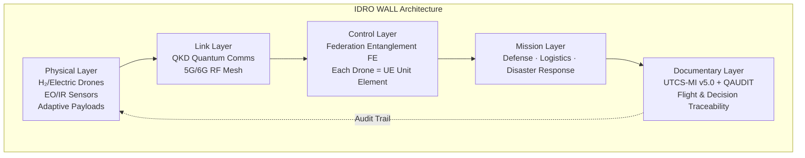
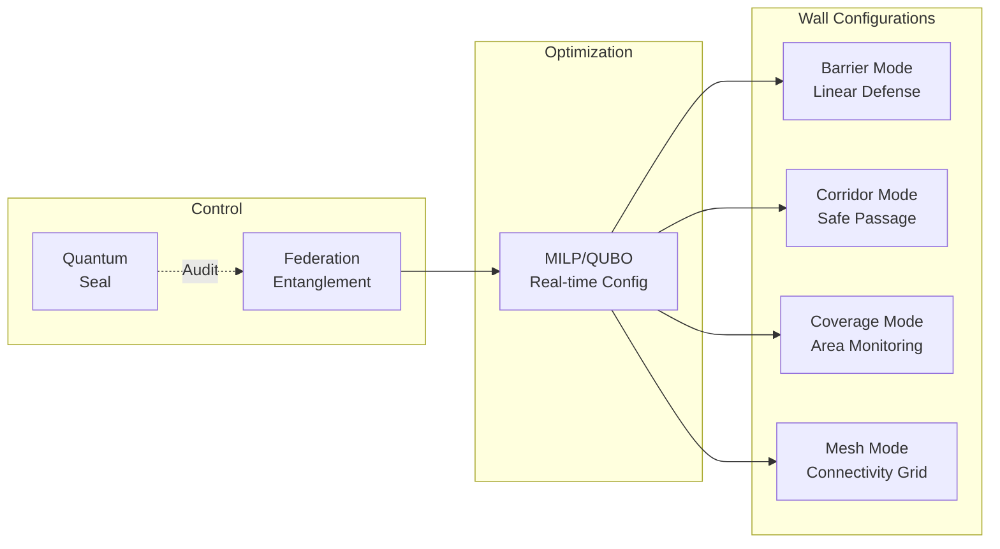
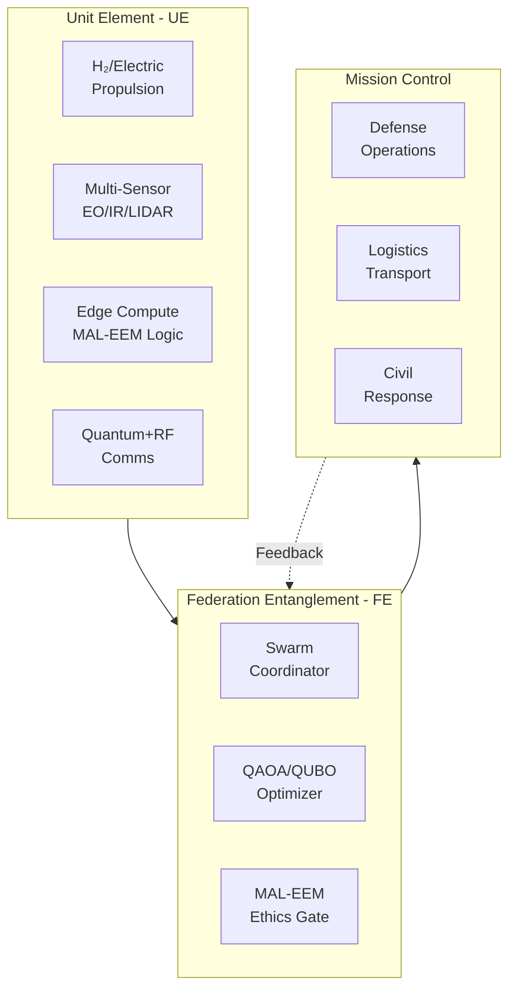

# IDRO WALL — IDEALE DRONE WALL

**IDEALE DRONE WALL (IDRO WALL)** is a distributed aerial mesh of autonomous drones governed under UTCS/QS and MAL-EEM, acting as **dual-use infrastructure** for defense, energy logistics, and civil resilience across Europe.

The system represents a **cognitive-drone barrier**: not a physical wall, but a configurable swarm that forms dynamic aerial structures for protection, monitoring, and rapid response.

---

## Quick Nav

* [Concept Overview](#concept-overview)
* [IDEALE Framework Integration](#ideale-framework-integration)
* [Architecture](#architecture)
* [Use Cases](#use-cases)
* [Domain Index](#domain-index)
* [Technical Implementation](#technical-implementation)
* [Certification & Compliance](#certification--compliance)
* [Integration with ASI-T2 Portfolio](#integration-with-asi-t2-portfolio)

---

## Concept Overview

**IDRO WALL** = **I**ntelligence · **D**efence · **E**nergy · **A**erospace · **L**ogistics · **E**urope **DRONE WALL**

A **distributed aerial mesh network of autonomous drones** that provides:

* **Defense & Security**: Dynamic aerial barrier against intrusions (configurable swarm, not fixed structure)
* **Energy & Logistics Management**: Flying nodes in a network that transport, monitor, and power H₂/electric microgrids
* **Civil Resilience**: Rapid disaster response (fires, floods, blackouts) via aerial barrier deploying sensors and connectivity
* **European Certification**: Operating under auditable framework (CS-23/25 for aircraft, CS-UAS for drones, SORA-EASA), linked with IDEALE

---

## IDEALE Framework Integration

The IDRO WALL embodies all pillars of the IDEALE framework:

### Intelligence (I)
* Real-time threat assessment and environmental monitoring
* Swarm intelligence for collective decision-making
* Integration with QAIM-2 quantum optimization for mission planning
* Predictive analytics for disaster response

### Defence (D)
* Electronic countermeasures (ethical jamming)
* Anti-drone defense capabilities
* Border and infrastructure patrol
* Coordinated with MAL-EEM for ethical engagement rules

### Energy (E)
* H₂-powered and electric hybrid propulsion
* Mobile energy distribution nodes
* Microgrid monitoring and support
* Renewable energy infrastructure protection

### Aerospace (A)
* CS-UAS compliant drone platforms
* Multi-layer airspace coordination
* Integration with UTM (UAV Traffic Management)
* SORA risk assessment framework

### Logistics (L)
* Autonomous transport of critical supplies
* H₂ cartridge delivery to remote locations
* Medical kit and spare parts distribution
* Supply chain resilience in crisis

### Europe (E)
* EASA certification pathway
* Compliance with EU drone regulations
* Cross-border coordination framework
* Integration with European Defence Agency (EDA)

---

## Architecture

### System Layers

### Dynamic Wall Formation

The IDRO WALL is not a static structure but a **reconfigurable aerial formation**:

### Component Architecture

---

## Use Cases

### 1. Defence Operations

**Electronic Warfare & Patrol**
* Ethical jamming of hostile communications
* Anti-drone interception
* Border surveillance and monitoring
* Critical infrastructure protection

**Implementation**
* Real-time threat detection via sensor fusion
* Coordinated response through Federation Entanglement
* MAL-EEM ensures proportional response and collateral minimization

### 2. Energy & Logistics

**Mobile Energy Network**
* H₂ cartridge transport to remote stations
* Power grid monitoring and emergency support
* Renewable energy site inspection
* Microgrid connectivity in remote areas

**Implementation**
* Autonomous delivery routes optimized via QAIM-2
* Real-time energy demand monitoring
* Fail-safe protocols for critical deliveries

### 3. Civil Resilience & Disaster Response

**Emergency Response Wall**
* Post-disaster connectivity restoration (aerial mesh network)
* Fire monitoring and resource deployment
* Flood assessment and rescue coordination
* Medical supply delivery to isolated areas

**Implementation**
* Rapid deployment within 30 minutes of alert
* Self-organizing mesh provides communication backbone
* Sensor data aggregation for situational awareness

---

## Domain Index

The IDRO WALL system is organized by engineering domains following the standard ASI-T2 structure:

* **[AAA — Aerodynamics & Airframes](./domains/AAA/)**: Drone airframe design, aerodynamic optimization for hover and cruise
* **[IIS — Integrated Intelligence & Software](./domains/IIS/)**: MAL-EEM logic, swarm coordination, autonomous behaviors
* **[LCC — Linkages, Control & Communications](./domains/LCC/)**: QKD + RF mesh network, low-probability-of-intercept comms
* **[EDI — Electronics & Digital Instruments](./domains/EDI/)**: Multi-modal sensors (LIDAR, thermal, EO/IR), edge computing
* **[DDD — Digital & Data Defense](./domains/DDD/)**: Secure identity management, tamper-proof logging, cyber defense
* **[EEE — Electrical, Hydraulic & Energy](./domains/EEE/)**: Power systems, battery management, energy distribution
* **[CQH — Cryogenics, Quantum & H₂](./domains/CQH/)**: H₂ propulsion systems, quantum communication hardware

Each domain follows the **CAx (classical) → QOx (quantum) → ATA (certification)** structure.

---

## Technical Implementation

### Federation Entanglement (FE) Mapping

The CB→QB→UE→FE→FWD→QS bridge naturally applies to IDRO WALL:

* **CB (Classical Baseline)**: Individual drone hardware and software components
* **QB (Quantum Bridge)**: Quantum-optimized flight paths and coordination via QAOA
* **UE (Unit Element)**: Each drone as an autonomous unit with decision authority
* **FE (Federation Entanglement)**: The swarm collective coordinated through shared state
* **FWD (Forward)**: Mission execution with real-time adaptation
* **QS (Quantum Seal)**: Every swarm snapshot with auditable hash → EASA/EDA certifiable

### UTCS-MI Integration

Every "wall configuration" = snapshot of swarm with:
* Cryptographic hash of swarm state
* Mission parameters and objectives
* Ethical constraints and RoE
* Environmental conditions
* Performance metrics

This enables:
* Full auditability of all operations
* Certification evidence for EASA CS-UAS
* Compliance demonstration for EDA requirements
* Post-mission analysis and improvement

### Optimization Framework

**Real-time Configuration** via MILP/QUBO:
* Minimize energy consumption
* Maximize coverage or barrier effectiveness
* Optimize communication topology
* Balance mission objectives with ethical constraints

**Quantum Advantage**:
* QAOA for combinatorial optimization of drone placement
* VQE for mission parameter tuning
* Quantum annealing for rapid reconfiguration

---

## Certification & Compliance

### EASA CS-UAS Compliance

* **Operation Category**: Specific (SORA risk assessment)
* **Operational Authorization**: Multi-drone coordinated operations
* **Safety Objectives**: Collision avoidance, geo-fencing, RTL procedures
* **Security**: Secure C2 link, anti-hijacking measures

### European Defence Agency (EDA)

* **Interoperability**: NATO STANAG compatibility
* **Security Classification**: Appropriate handling procedures
* **Cross-border Operations**: EU coordination framework

### Civil Aviation Authority (CAA)

* **UTM Integration**: Coordination with manned aviation
* **Airspace Coordination**: Class G operation with NOTAM procedures
* **Emergency Procedures**: Documented fail-safe protocols

### Documentation Standards

* **DO-178C/DO-326A**: Software assurance for critical systems
* **ARP4754A**: Development assurance for complex systems
* **DO-356A/DO-355**: Airworthiness security process
* **RTCA DO-377**: UAS security guidance

---

## Integration with ASI-T2 Portfolio

### TFA Repository Mapping

IDRO WALL maps as:
* **Product Line**: GAIA-AIR → Aerospace/Defence → Drones/Swarm Systems
* **TFA Structure**: Fully compliant with CB→QB→UE→FE→FWD→QS
* **Evidence Chain**: UTCS-MI v5.0 for all operations

### Cross-Product Synergies

**ETHICS-EMPATHY-UAV**
* Shared MAL-EEM ethical framework
* Common swarm coordination protocols
* Joint training and simulation environments

**HYDROBOTS**
* H₂ propulsion technology sharing
* Logistics coordination for H₂ infrastructure
* Common maintenance and support systems

**META-OS Aerospace**
* Core OS components for drone systems
* Real-time operating system requirements
* Secure boot and OTA update framework

**QAIM-2**
* Quantum optimization for mission planning
* QUBO encoding for swarm coordination
* Integration with quantum computing resources

---

## Analogies & Vision

The **IDRO WALL** serves as the **"European Drone Shield"** but with key differentiators:

* **Modular**: Components can be added or removed based on mission
* **Federated**: Coordinated but with distributed authority
* **Sustainable**: H₂-powered with minimal environmental impact
* **Adaptable**: Reconfigures in real-time based on needs

Not a fortress, but an **adaptive skin** covering:
* Borders
* Critical infrastructure
* Logistics corridors
* Emergency response zones

---

## Next Steps

### Phase 1: Concept Development (Q1 2025)
- [ ] Domain structure completion
- [ ] Initial SORA risk assessment
- [ ] MAL-EEM ethical framework adaptation
- [ ] Preliminary EASA consultation

### Phase 2: Prototype Development (Q2-Q3 2025)
- [ ] 5-drone testbed development
- [ ] QKD communication testing
- [ ] QAIM-2 optimization validation
- [ ] Simulation environment setup

### Phase 3: Certification Preparation (Q4 2025)
- [ ] CS-UAS compliance documentation
- [ ] EDA coordination framework
- [ ] UTCS-MI v5.0 audit trail validation
- [ ] Safety case development

### Phase 4: Operational Deployment (2026)
- [ ] Pilot deployments in controlled environments
- [ ] Integration with national UTM systems
- [ ] Cross-border coordination trials
- [ ] Full operational capability declaration

---

## Scope Anchors

* **Field**: Defense (with dual-use civil applications)
* **Environment**: Air-Unmanned (urban, suburban, complex terrain)
* **Lifecycle**: Domain-driven architecture with QAIM-2 quantum augmentation
* **Documentation**: ATA-aligned folders adapted for swarm systems
* **Ethics**: MAL-EEM fail-closed guardrails on all operations
* **Traceability**: QS/UTCS for complete evidence chain

---

## Glossary & Acronyms

* **CB→QB→UE→FE→FWD→QS**: Classical Baseline → Quantum Bridge → Unit Element → Federation Entanglement → Forward → Quantum Seal
* **CS-UAS**: EASA Certification Specifications for Unmanned Aircraft Systems
* **EDA**: European Defence Agency
* **FE**: Federation Entanglement (swarm coordination framework)
* **IDEALE**: Intelligence · Defence · Energy · Aerospace · Logistics · Europe
* **IDRO WALL**: IDEALE DRONE WALL
* **MAL-EEM**: Ethics & Empathy Module (fail-closed safety system)
* **QAIM-2**: Quantum AI Model for Industrial Management
* **QKD**: Quantum Key Distribution
* **QS**: Quantum Seal (cryptographic audit trail)
* **QUBO**: Quadratic Unconstrained Binary Optimization
* **SORA**: Specific Operations Risk Assessment (EASA framework)
* **UE**: Unit Element (individual autonomous drone)
* **UTM**: UAV Traffic Management
* **UTCS-MI**: Universal Traceability & Configuration System - Mission Intelligence

---

*Part of GAIA-AIR portfolio under ASI-T2 - Artificial Super Intelligence Transponders for Aerospace Sustainable Industry Transition*
