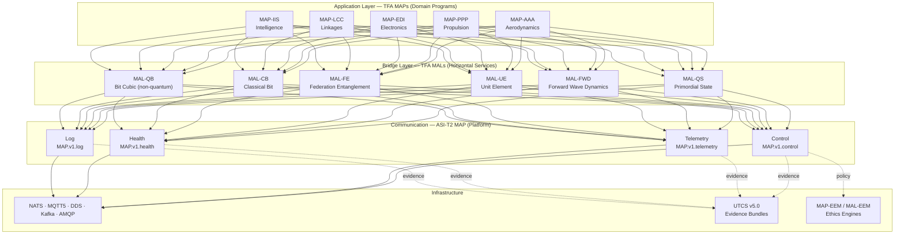

# Integration Architecture: **ASI‑T2 MAP ↔ TFA Ecosystem**

> **IDEALE‑EU — Intelligence, Defense, Energy, Aerospace, Logistics (ESG‑EU)**
> Strategy overlay guiding governance, disclosure and EU‑centric impact across nodes.

---

## Executive Summary

This document **clarifies and codifies** the relationship between three complementary constructs in the ASI‑T2 ecosystem:

| Acronym        | Full Name                       | Scope                        | Purpose                                                                                                       |
| -------------- | ------------------------------- | ---------------------------- | ------------------------------------------------------------------------------------------------------------- |
| **ASI‑T2 MAP** | **Master Application Platform** | Communication Infrastructure | Transport‑agnostic messaging backbone with contracts, security (MAP‑EEM), and evidence (UTCS)                 |
| **TFA MAP**    | **Master Application Program**  | Per‑Domain Services          | Domain programs exposing stable SI/DI interfaces (e.g., MAP‑AAA, MAP‑PPP, MAP‑EDI)                            |
| **TFA MAL**    | **Main Application Layer**      | Per‑Bridge Services          | Horizontal services aligned to **QS→FWD→UE→FE→CB→QB** (e.g., MAL‑QS, MAL‑FWD, MAL‑UE, MAL‑FE, MAL‑CB, MAL‑QB) |

**Key outcomes**

* **Clean separation of concerns:** Programs (TFA MAP) use layer services (TFA MAL) over a common wire (ASI‑T2 MAP).
* **Deterministic evidence:** UTCS bundles render releases auditable across repos, docs, and binaries.
* **Ethical guardrails:** MAP‑EEM/MAL‑EEM enforce allow‑lists, decision logging, and revocation.
* **Standards alignment:** S1000D/ATA path grammar, DO‑178C/ECSS guidance, IEC 62443.

---

## 0. Normative Language

The key words **MUST**, **MUST NOT**, **REQUIRED**, **SHALL**, **SHALL NOT**, **SHOULD**, **SHOULD NOT**, **RECOMMENDED**, **MAY** are to be interpreted as normative requirements in this document.

---

## 1. Positioning & Responsibilities



### 1.1 Boundaries (normative)

* **TFA MAP (Program)** **MUST** encapsulate domain logic and expose **stable SI/DI** interfaces.
* **TFA MAL (Layer)** **MUST** provide layer‑specific services matching the bridge semantics.
* **ASI‑T2 MAP (Platform)** **MUST** provide contracts, security, transport adapters, and evidence hooks.
* Cross‑concern bleed **MUST NOT** occur (e.g., programs MUST NOT embed transport decisions; platform MUST NOT embed domain logic).

---

## 2. TFA Bridge Semantics (canonical)

**QS → FWD → UE → FE → CB → QB**

* **QS (Primordial):** origin/reference of state.
* **FWD (Prediction/Probability; Forward Wave Dynamics):** predictive/retrodictive propagation from QS.
* **UE (Unit Element / Collapse):** atomic state decision and collapse to execution.
* **FE (Federation Entanglement / Contracting):** inter‑system contracts/SLOs and coordination.
* **CB (Classical Bit / Companion Binary):** deterministic classical computation/artifacts.
* **QB (Bit Cubic; non‑quantumised):** discrete 3D lifting (`CB×CB×CB`), **not** a qubit.

> **Note (non‑normative):** *Qubits* live in a tetrahedral continuum+ and include **transposition/projection times** and **teleportation‑relative delay/phase** vs **TP₀**; qubits are **not** used in the TFA flow; **QB** is non‑quantum.

### 2.1 Mapping to Services & Wire

| Layer   | TFA MAL Service | ASI‑T2 MAP Usage                                                          |
| ------- | --------------- | ------------------------------------------------------------------------- |
| **QS**  | MAL‑QS          | `map/1/log` (state snapshots); `map/1/telemetry` (state hashes, versions) |
| **FWD** | MAL‑FWD         | `map/1/telemetry` (nowcasts/forecasts); `map/1/control` (requests)        |
| **UE**  | MAL‑UE          | `map/1/control` (atomic exec); `map/1/telemetry` (results)                |
| **FE**  | MAL‑FE          | `map/1/control` (coordination); `map/1/telemetry` (federation state)      |
| **CB**  | MAL‑CB          | `map/1/control` (solve/validate); `map/1/telemetry` (metrics/solutions)   |
| **QB**  | MAL‑QB          | `map/1/control` (optimize_qb); `map/1/telemetry` (energies/solutions)     |

---

## 3. Repository Grammar & CSDB Mapping

**Normative path:**

```
domains/<DOMAIN_CODE>/ATA-XX/<XX-XX>_<DESCRIPTION>/S1000D/<LAYER>/<PACK>/<SUBPACK>
```

* `<DOMAIN_CODE>` ∈ {AAA, AAP, CCC, CQH, DDD, EDI, EEE, EER, IIF, IIS, LCC, LIB, MEC, OOO, PPP}
* `<LAYER>` ∈ {QS, FWD, UE, FE, CB, QB}
* `<PACK>` ∈ {**CAx**, **QOx**, **PAx**}; **PAx orientation markers are ONLY:** **OB (Onboard)**, **OFF (Outboard)**.
* `AMPEL360/` is the **commons progenitor** (ontology/deontology/source‑data), **no app code**.

**Digital Platforms (CSDBs)**
AMPEL‑360 CSDB · GAIA‑AIR CSDB · GAIA‑SPACE CSDB · H₂‑AIRPORT CSDB · BITFINANCE CSDB · INTELLIGENCE‑SECRETARY CSDB.

---

## 4. Topic Hierarchy (Wire Grammar)

**ASI‑T2 MAP topics**:

```
map/<major>/<contract>/<program>/<domain>/<component>/<stream>
```

**Mapping to TFA structure**:

```
map/1/<contract>/<PROGRAM>/<DOMAIN>/<GROUP>/<LLC>/<LAYER>
```

* `<LAYER>` ∈ {QS,FWD,UE,FE,CB,QB} (last segment when layering is material to the stream).

**Examples (BWB‑Q100)**

```
# State provenance
map/1/log/BWB-Q100/AAA/STATES/QS/QS
map/1/telemetry/BWB-Q100/AAA/STATES/QS/QS

# Nowcast (FWD)
map/1/control/BWB-Q100/AAA/WAVES/FWD/FWD
map/1/telemetry/BWB-Q100/AAA/WAVES/FWD/FWD

# Classical solver (CB)
map/1/control/BWB-Q100/AAA/SYSTEMS/SI/CB
map/1/telemetry/BWB-Q100/AAA/SYSTEMS/SI/CB

# Quantum‑inspired optimizer (QB)
map/1/control/BWB-Q100/AAA/QUBITS/QB/QB
map/1/telemetry/BWB-Q100/AAA/QUBITS/QB/QB

# Federation (FE)
map/1/control/BWB-Q100/FLEET/ELEMENTS/FE/FE
map/1/telemetry/BWB-Q100/FLEET/ELEMENTS/FE/FE
```

---

## 5. Security & Ethics

* **MAP‑EEM** (platform) **MUST** authorize subject×action×resource×context; log decisions; support emergency revocation.
* **MAL‑EEM** (layers/programs) **SHOULD** declare allowable uses per domain and layer; **MUST NOT** enable weaponisation; dual‑use under control.
* Wire security: Ed25519 signatures (H0), X25519 envelope encryption (H1), TLS 1.3/mTLS where applicable.
* Threat mitigations: replay windows, monotonic `seq`, key rotation, schema signing, minor‑compat floor.

---

## 6. Evidence & UTCS v5.0

**UTCS = UiX Threading (Context/Content/Cache) & Structure/Style/Sheet.**
**Bundles MUST** include manifest, hashes, and signatures; **SHOULD** carry SBOM and DOI metadata.

**Pipeline (normative):**

```
1) git tag -s vX.Y.Z
2) syft dir:. -o spdx-json > evidence/sbom.spdx.json
3) build UTCS bundle (manifest + hashes)
4) cosign sign-blob (artifacts)
5) publish DOI (Zenodo/DataCite)
6) index in Hall of Records
```

---

## 7. Compliance & Standards

S1000D/ATA path grammar; ARP4754A/ARP4761 (scoped); DO‑178C C/D (guidance); DO‑254 (when HW programmable); ECSS (progressive); IEC 62443; ISO/IEC 27001; export/dual‑use: EU 2021/821; ITAR/EAR as applicable.

---

## 8. Deployment Profiles (Edge · Site · Hub)

*As per MAP Master Whitepaper #2, with emphasis that TFA MAPs and MALs are deployable in any profile so long as they speak ASI‑T2 MAP contracts and pass policy.*

---

## 9. Reference Implementation Sketch (illustrative)

* **MAL‑CB** subscribes `map/1/control/<prog>/<dom>/+/+/CB`, publishes solutions to `…/SYSTEMS/SI/CB`.
* **MAL‑QB** subscribes `…/QB/QB`, publishes energies/solutions to `…/QUBITS/QB/QB`.
* **MAL‑FWD** serves `request_nowcast` and publishes `…/WAVES/FWD/FWD`.
* **MAL‑FE** coordinates assets and publishes `…/FLEET/ELEMENTS/FE/FE`.
* **MAL‑QS** logs immutable state to `…/STATES/QS/QS` (log + telemetry).

---

## 10. Governance & Versioning

* **SemVer**: `MAJOR.MINOR.PATCH` on platform and schemas.
* **MINOR** MUST be wire‑compatible; **MAJOR** MAY break with migrators.
* **SSoT** (Universal Injection Prompt v1) governs canon changes.
* **IDEALE‑EU** overlays ESG‑EU disclosures per release.

---

## 11. Roadmap Synchronisation

| Horizon | MAP (Platform)                                    | MAL (Layers)                           | MAP (Programs)                             |
| ------- | ------------------------------------------------- | -------------------------------------- | ------------------------------------------ |
| **H0**  | ctl/tmx/hlth/log; NATS/MQTT5; UTCS hooks          | QS/FWD/UE/FE/CB/QB service skeletons   | BWB‑Q100 baseline topics & CSDB wiring     |
| **H1**  | DDS/RTPS; X25519; dashboards                      | Optimizers, migrators, federation APIs | GAIA‑SAT channels; H₂‑Airport CSDB streams |
| **H2**  | Multi‑org federation; formal verification; audits | TPM/SE roots; third‑party validators   | Public demos; external validations         |

---

## 12. Glossary & Acronyms (canonical)

### Bridge & Quantum Semantics

* **QS** — *Primordial*.
* **FWD** — *Prediction/Probability; Forward Wave Dynamics*.
* **UE** — *Unit Element / Collapse*.
* **FE** — *Federation Entanglement / Contracting*.
* **CB** — *Classical Bit / Companion Binary*.
* **QB** — *Bit Cubic (non‑quantumised)*.
* **Qubit/QC** — full‑quantum continuum including transposition/projection time and teleportation‑relative delay/phase vs **TP₀**.

### Packs & Engineering

* **CAx** — Computer‑Aided X (CAD/CAE/CAM/CAT/CFD).
* **QOx** — **Quantum Optimizations**.
* **PAx** — Packaging & Assemblies (**OB/OFF** only).
* **OB/OFF** — Onboard / Outboard.

### Platforms & Policy

* **ASI‑T2 MAP** — Master Application **Platform** (contracts + security + transports + evidence).
* **TFA MAP** — Master Application **Program** (domain programs).
* **TFA MAL** — Main Application **Layer** (bridge‑aligned services).
* **MAP‑EEM / MAL‑EEM** — Ethics & Empathy Models (platform / layers).

### Evidence & Ops

* **UTCS** — **UiX Threading Context/Content/Cache & Structure/Style/Sheet**.
* **SSoT** — Single Source of Truth.
* **SBOM** — Software Bill of Materials.
* **DOI** — Digital Object Identifier.
* **CI/CD** — Continuous Integration / Continuous Delivery.

### Domain Codes (TFA `domains/`)

AAA · AAP · CCC · CQH · DDD · EDI · EEE · EER · IIF · IIS · LCC · LIB · MEC · OOO · PPP.

---

## 13. How to Cite

> Pelliccia, A. (2025). *Integration Architecture: TFA MAP · TFA MAL · ASI‑MAP (Definitive Clarification)*. v0.1.0. DOI: TBA.

---

## 14. Licence & Responsible Use

Open draft under **responsible use**. Redistribution/modification MUST retain **MAP‑EEM**/**MAL‑EEM** references and peaceful‑use restrictions.

---

## Appendix A — Schema & Validator References

### JSON Schemas

All schemas are located in `WHITEPAPERS/schemas/integration/`:

**MAL Service Contracts:**
* `mal-qs.schema.json` — MAL-QS (Primordial State) service contract
* `mal-fwd.schema.json` — MAL-FWD (Forward Wave Dynamics) service contract
* `mal-ue.schema.json` — MAL-UE (Unit Element) service contract
* `mal-fe.schema.json` — MAL-FE (Federation Entanglement) service contract
* `mal-cb.schema.json` — MAL-CB (Classical Bit) service contract
* `mal-qb.schema.json` — MAL-QB (Bit Cubic) service contract

**ASI-T2 MAP Platform Contracts:**
* `map-control.schema.json` — MAP control contract schema
* `map-telemetry.schema.json` — MAP telemetry contract schema
* `map-health.schema.json` — MAP health contract schema
* `map-log.schema.json` — MAP log contract schema

### Validation Scripts

Located in `scripts/`:
* `validate_topic_hierarchy.py` — Validates topic naming and hierarchy
* `validate_bridge_flow.py` — Validates bridge flow semantics (QS→FWD→UE→FE→CB→QB)

### Example Implementations

Sample MAL service implementations are provided in `WHITEPAPERS/examples/mal-services/`:
* `mal-qs-example.yaml` — MAL-QS service configuration example
* `mal-cb-example.yaml` — MAL-CB service configuration example
* `mal-qb-example.yaml` — MAL-QB service configuration example

---

*End of Integration Whitepaper #2*
