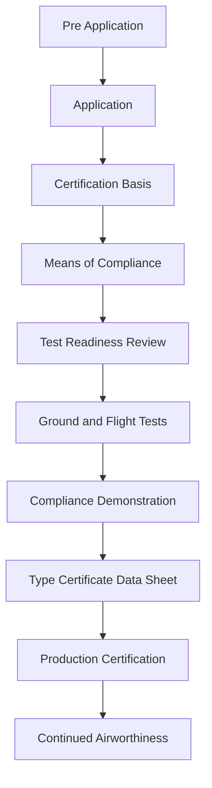
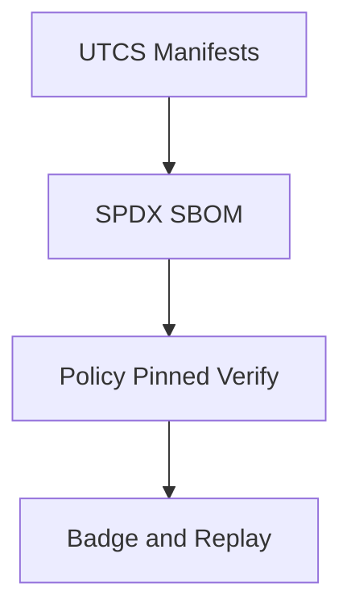

# Whitepaper 5 · BWB Certification


> **Scope**: Certification strategy and evidence architecture for **AMPEL360** **BWB** **Q100**.  
> **Goal**: Produce a regulator‑ready, replayable certification evidence set mapped to **CS‑25** and allied standards, using **UTCS → SPDX → Verify → Badge**.

---

## 1. Canon and Context

- **Family**: AMPEL360  
- **Model**: BWB  
- **Variant**: Q100  · configured model for ~100 passengers (hydrogen‑hybrid)  
- **Profiles**: **TFA** Aerospace Profile (IDEALE)  
- **Domains**: AAA Aerodynamics and Airframes · PPP Propulsion and Fuel Systems · CQH Cryogenics and Hydrogen · EEE Electrical Hydraulic and Energy · EER Environmental Emissions and Remediation · IIS Integrated Intelligence and Software · CCC Cabin Cockpit Cargo

**Repository anchors**

- Product tree: `PRODUCTS/AMPEL360/AMPEL360_AIR_TRANSPORT/`  
  (If current tree uses `BWB-Q100`, keep as alias and plan migration to `BWB/Q100`.)
- Evidence: `sbom/AMPEL360/BWB/Q100/...`  
- S1000D and ATA: under `domains/<CODE>/ata/ATA-xx/`

---

## 2. Certification Strategy

**Objectives**

1. Establish **Certification Basis** for BWB Q100 under CS‑25  · define **Special Conditions** for hydrogen and novel BWB cabin/evacuation.  
2. Freeze **Means of Compliance (MoC)** and verification plan  · simulation, ground, flight.  
3. Produce **deterministic, replayable evidence** through UTCS manifests + CI.  
4. Align with **FAA** via bilateral pathways  · plan for TIP and mutual recognition.

**Guiding principles**

- **Evidence over assertion**: every claim backed by executable checks and logs.  
- **Fail‑closed CI**: policy or traceability gaps block merges.  
- **Digital continuity**: models → analysis → tests → S1000D deliverables reference each other via UTCS.

---

## 3. Phases and Milestones



**Deliverables by phase (excerpt)**

* **P0**  Stakeholder map · initial hazards (HARA) · UTCS MI seeds · Issue Papers list
* **P2**  Certification Plan · Certification Basis · draft Special Conditions (hydrogen, BWB cabin)
* **P3**  MoC matrix · test plans · model validation plan · safety case GSN baseline
* **P4**  TRR pack · conformity inspection plan · instrumentation plan
* **P5**  Test cards · telemetry · DO‑160 environmental data · lightning HIRF · icing
* **P6**  Compliance statements per paragraph · cross‑refs to UTCS artifacts
* **P7**  TCDS package · limitations and OEB items · AFM and ICA updates
* **P9**  Continued airworthiness plan · service bulletins process · incident evidence hooks

---

## 4. Certification Basis  · initial view

> This section defines the **rules** and any **special conditions** applicable to BWB Q100.

* **Primary**: EASA **CS‑25** with hydrogen and BWB‑specific **Special Conditions**
* **Associated**: ETSO where applicable · environmental rules (noise, emissions)
* **Cross‑ref**: FAA 14 CFR Part 25 for bilateral alignment

**Expected Special Conditions topics**

* Hydrogen storage and distribution  · **cryogenics** · ventilation · detection · inerting
* Fuel cell or H2 combustion safety  · isolation · shutdown · fire protection
* BWB cabin layout  · egress paths · 90‑second evacuation · visibility and signage
* Pressurization, crashworthiness, ditching analyses adapted to BWB geometry
* Electrical energy systems integration and thermal runaway protection

> Final CB to be captured as `ATA/CS-25/CB/CB-vX.Y.utcs.yaml` with paragraph‑level links.

---

## 5. Means of Compliance  · matrix skeleton

| Rule ID     | Subject                             | MoC Type            | Evidence Artifact                        | Owner | Status |
| ----------- | ----------------------------------- | ------------------- | ---------------------------------------- | :---: | :----: |
| CS‑25.301   | Loads                               | Analysis Test       | `AAA/cax/analysis/loads/*` · UTCS refs   |  AAA  |   TBD  |
| CS‑25.305   | Strength and Deformation            | Analysis Test       | FEM reports · coupons · UTCS             |  AAA  |   TBD  |
| CS‑25.335   | High Speed Stability and Control    | Analysis Flight     | CFD FTE reports · flight data · UTCS     |  AAA  |   TBD  |
| CS‑25.561   | Emergency Landing Loads             | Analysis Test       | Crash energy models · test films · UTCS  |  AAA  |   TBD  |
| CS‑25.571   | Damage Tolerance Fatigue Evaluation | Analysis Test       | DT plans · coupons · UTCS                |  AAA  |   TBD  |
| CS‑25.603   | Materials                           | Inspection          | Material specs · trace · UTCS            |  MEC  |   TBD  |
| CS‑25.853   | Compartment Interiors Flammability  | Test                | Burn test reports · UTCS                 |  CCC  |   TBD  |
| CS‑25.857   | Cargo Compartments                  | Analysis Test       | Cargo safety report · UTCS               |  CCC  |   TBD  |
| CS‑25.901   | Installation Engines                | Inspection Test     | PPP installation evidence · UTCS         |  PPP  |   TBD  |
| CS‑25.981   | Fuel System Safety                  | Analysis Test       | Hydrogen SC set · CQH cryo tests · UTCS  |  PPP  |   TBD  |
| CS‑25.1301  | Function and Installation           | Analysis Inspection | System ICDs · UTCS                       |  IIS  |   TBD  |
| CS‑25.1309  | Equipment Systems Safety            | SSA DO‑178C DO‑254  | FHA PSSA SSA · DAL table · UTCS          |  IIS  |   TBD  |
| CS‑25.1321  | Arrangement and Visibility          | Inspection          | Cockpit layout · HMI · UTCS              |  CCC  |   TBD  |
| CS‑25.1419  | Ice Protection                      | Analysis Test       | Ice tunnel reports · flight icing · UTCS |  AAA  |   TBD  |
| Noise rules | External Noise Compliance           | Test                | Acoustic measurements · UTCS             |  EER  |   TBD  |
| Emissions   | Environmental Compliance            | Analysis Test       | LCA EPD · EER metrics · UTCS             |  EER  |   TBD  |

> Expand and freeze the MoC matrix in CSV under `WHITEPAPERS/reports/moc_matrix.csv` with UTCS IDs per row.

---

## 6. Safety Case and Assurance

* **Process model**: ARP4754A for development assurance, **ARP4761** for safety
* **Software**: **DO‑178C** with supplements as needed · **DAL allocation** via FHA PSSA SSA
* **Hardware**: **DO‑254** for complex airborne electronic hardware
* **Environmental**: **DO‑160** qualification profiles
* **Content provenance**: C2PA for public deliverables as needed

**GSN backbone**

* Use existing `WHITEPAPERS/ASI_GSN_Safety_Case.gsn` as the safety spine.
* Gate every strategy and solution node with a UTCS reference and CI verification step.

---

## 7. Hydrogen and BWB Specific Topics

**Hydrogen systems · CQH PPP**

* Cryogenic storage  · tank integrity  · boil off management
* Leak detection  · ventilation  · hazardous area classification
* Fire protection  · isolation  · emergency procedures

**BWB cabin and egress · CCC AAA**

* Evacuation analysis  · 90‑second demonstration planning
* Lighting and signage  · accessibility  · crew coordination
* Pressurization envelopes and rapid decompression in BWB geometry

**Flight control and handling · AAA IIS**

* FBW architecture  · redundancy  · DAL A pathways
* Envelope protection logic and test methods
* Flutter and aeroelastic margins for blended geometry

---

## 8. Evidence Architecture · UTCS → SPDX → Verify → Badge



* **UTCS** anchors: each artifact has a `artifact.manifest.yaml` with inputs outputs and ATA refs
* **SBOM**: OB and OFF packages under `sbom/AMPEL360/BWB/Q100/{OB,OFF}/<date>/...`
* **Verify**: CI workflows check schemas signatures and conformance gates
* **Badge**: publish status and deep links to evidence blobs

<details>
  <summary><strong>UTCS Certification Pack · skeleton</strong></summary>

```yaml
id: UTCS-MI:v5.0:AMPEL360:PAX:BWB:Q100:ATA-00:cert-pack
framework: IDEALE.eu
bridge: QS→FWD→UE→FE→CB→QB
source:
  repo_path: WHITEPAPERS/MASTER_WHITEPAPER_5_BWB_CERTIFICATION.md
  commit: <git-sha>
  created_at: <iso8601>
context:
  who:
    org: IDEALE.eu
    team: TFA Architecture
    owner: cert@ideale.eu
  what:
    product_family: AMPEL360
    product_model: BWB
    variant: Q100
  where:
    env: OFF
    region: EU
  when:
    ts_build: <iso8601>
    ts_verify: <iso8601>
  why:
    objective: certification
    ticket_ref: <issue or docket>
evidence:
  sbom:
    format: SPDX-2.3
    path: sbom/AMPEL360/BWB/Q100/OFF/<date>/AMPEL360-BWB-Q100-OFF-rc1.spdx.json
  verify_log: .evidence/logs/<run-id>.jsonl
provenance:
  signatures:
    qs_anchor: <sha256>
ethics_guard: MAL-EEM
classification: INTERNAL–EVIDENCE-REQUIRED
```

</details>

---

## 9. Data Packages and S1000D Mapping

* **ATA** is the source of truth for documents.
* Every CAX QOX PAX artifact references **ATA DMs** and vice‑versa.

**Examples**

* `domains/AAA/ata/ATA-57/S1000D/DMRL.xml` — structures and control surfaces
* `domains/PPP/ata/ATA-28/S1000D/...` — hydrogen fuel system
* `domains/CCC/ata/ATA-25/S1000D/...` — interiors and evacuation

> CI validates S1000D XML against official XSDs; Schematron rules enforce project‑level BREX.

---

## 10. Test Program Outline

* **Simulation**: CFD FEA MBSE envelope • verify correlation factors and uncertainty budgets
* **Ground tests**: structures fatigue HIRF lightning icing fire safety cryo operations
* **Flight tests**: handling qualities performance noise emissions icing envelope clearance
* **Data integrity**: UTCS run manifests · calibration and instrumentation UTCS

**Test card template**

```
ID: FT-Q100-<seq>
Objective: <objective>
Configuration: BWB Q100
Instrumentation: <sensors and buses>
Steps: <1..n>
Safety: <abort criteria, limitations>
Data Capture: <channels, rates, timing>
UTCS: <path to manifest>
```

---

## 11. Compliance Statements

For each rule paragraph:

* **Statement**: concise claim of compliance
* **Method**: Analysis Test Inspection or Combination
* **Evidence**: UTCS IDs to reports data and logs
* **Status**: Planned In Progress Complete Accepted

> Freeze the canonical CSV as `WHITEPAPERS/reports/compliance_statements.csv`.

---

## 12. Governance and RACI

| Role             | Responsibility                               |
| ---------------- | -------------------------------------------- |
| Chief Engineer   | Certification plan and strategy              |
| Safety Lead      | ARP4761 artifacts and DAL allocations        |
| Systems Lead     | ARP4754A flow and ICDs                       |
| Hydrogen Lead    | CQH PPP safety and tests                     |
| Flight Test Lead | TRR cards telemetry compliance demonstration |
| Documentation    | S1000D ATA and compliance statements         |
| CI Stewards      | UTCS Verify SBOM badges and policy gates     |

---

## 13. Open Issues and Risks  · initial register

* Evacuation models for BWB cabin and demonstration plan
* Hydrogen cryogenic safety envelopes in abnormal conditions
* FBW fault detection coverage and DAL A pathways
* Flutter margins under blended geometry edge cases
* Icing and de‑icing procedures for BWB planform

> Track these in `WHITEPAPERS/reports/open_issues.csv` with UTCS IDs.

---

## 14. Next Actions  · two sprints

**Sprint 1**

* Freeze **Certification Basis** draft and Special Conditions list
* Expand **MoC matrix** to top CS‑25 chapters and allocate owners
* Commit **UTCS Certification Pack** and CI checks

**Sprint 2**

* Publish **S1000D DMRL** seeds for ATA 25 28 57
* Land **test program outline** and TRR checklist
* Generate first **SBOM OFF** package and badge

---

## Annex A  · References and Paths

* `sbom/AMPEL360/BWB/Q100/{OB,OFF}/<date>/...`
* `PRODUCTS/AMPEL360/AMPEL360_AIR_TRANSPORT/BWB/Q100/`  *(alias to legacy `BWB-Q100` if needed)*
* `.github/workflows/`  · `s1000d-checks.yml` · `sbom-attest.yml` · `validate-manifests.yml`
* `WHITEPAPERS/ASI_GSN_Safety_Case.gsn` · `ASI_Policy.rego` · `ASI_Threat_Register.csv`

---

*This document is part of the IDEALE‑EU TFA profile and inherits repository evidence policies. All compliance claims require UTCS‑anchored evidence reviewed via CI.*
