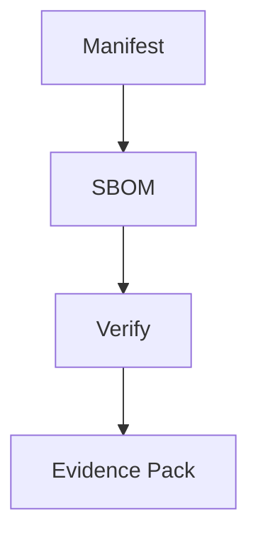

# IDEALE Evidence Framework (IEF) — Standards v0.1 DRAFT

**Status:** DRAFT (derived from AAA/DELs aerospace implementation)  
**Last Updated:** 2025-10-05  
**Supersedes:** None (initial release)

> **Scope.** This is the **sector-agnostic baseline**. Domain profiles (Aerospace, Energy, Defense, …) extend or tighten these rules.

---

## What's in this package

```
standards/v0.1/
├── README.md
├── schemas/
│   ├── context.schema.json
│   └── examples/
│       ├── minimal.json
│       └── full.json
├── specs/
│   ├── SBOM-BASELINE.md
│   ├── VERIFY-SPEC.md
│   └── NAMING-POLICY.md
├── tests/
│   ├── conformance/
│   │   ├── valid/
│   │   │   ├── minimal.json
│   │   │   └── full.json
│   │   └── invalid/
│   │       ├── no-version.json
│   │       └── bad-type.json
│   └── run_tests.py
└── tools/
    ├── validate_manifest.py
    └── generate_checksums.sh
```

---

## Visual overview



---

## 1) Context manifest (baseline)

Repositories **must** include one manifest at:

* `IDEALE/context.manifest.json` (preferred)
* `IEF/context.manifest.json` (alt)
* `.ideale/context.manifest.json` (hidden)

**Minimal example**

```json
{
  "ief_version": "0.1",
  "name": "my-component",
  "type": "component",
  "exports": {
    "sbom": "sbom/component.spdx.json"
  }
}
```

See the full JSON Schema: [`schemas/context.schema.json`](./schemas/context.schema.json).

**Key fields**

|              Field | Req | Type   | Notes                                       |
| -----------------: | :-: | ------ | ------------------------------------------- |
|      `ief_version` |  ✅  | string | Must equal `"0.1"`                          |
|             `name` |  ✅  | string | Component or product identifier             |
|             `type` |  ✅  | enum   | `component` | `product` | `service`       |
|     `exports.sbom` |  ✅  | path   | Relative path to SPDX 2.3 document          |
|     `exports.docs` |  ❌  | path   | Optional documentation root                 |
| `exports.evidence` |  ❌  | path   | Optional evidence directory                 |
|          `context` |  ❌  | object | Optional metadata (who/what/where/when/why) |

<details>
  <summary><strong>UTCS → IEF mapping (for adopters with UTCS v5.0)</strong></summary>

* UTCS `context.what.product_family` → IEF `name` (if representing the product)
* UTCS `outputs[].path` (SBOM entry) → IEF `exports.sbom`
* Keep UTCS alongside IEF for domain rigor; IEF enables cross-domain portability.

</details>

---

## 2) SBOM baseline (SPDX 2.3)

**Minimum:**

1. SPDX **2.3** format
2. Document fields:
   `spdxVersion`, `dataLicense`, `SPDXID`, `name`, `documentNamespace`, `creationInfo.creators[]`
3. At least **one** `packages[]` entry with:
   `SPDXID`, `name`, `downloadLocation` (or `NOASSERTION`), `filesAnalyzed` (bool), `licenseConcluded` (or `NOASSERTION`)

See: [`specs/SBOM-BASELINE.md`](./specs/SBOM-BASELINE.md).

---

## 3) Verification

An IEF verifier **must** check:

1. **Manifest schema** — parses, validates, required fields present, exported paths exist
2. **SBOM presence & validity** — file exists, SPDX 2.3 parses, ≥1 package
3. **Checksums** (if present) — deterministic order, all hashes match
4. **Reproducibility** — checksum generation is path-sorted and stable

Optional (profile-specific): signatures, policy pinning, chain-of-custody, bridge layers.

Output format reference: [`specs/VERIFY-SPEC.md`](./specs/VERIFY-SPEC.md).

---

## 4) Naming policy

**Recommended pattern (non-binding in v0.1):**

```
IEF-<ORG>-<PRODUCT>-<SCOPE>-r<REV>.<EXT>
# e.g. IEF-ACME-WIDGET-CORE-r001.zip
```

Profiles may enforce stricter conventions. See: [`specs/NAMING-POLICY.md`](./specs/NAMING-POLICY.md).

---

## 5) Evidence pack

Recommended structure for submissions:

```
evidence-pack-<DATE>/
├── manifest.json
├── sbom/component.spdx.json
├── checksums.sha256
├── verification/verify-results.json
├── signatures/              # optional
└── README.md
```

Minimal README and verification steps are provided below:

```bash
sha256sum -c checksums.sha256
python standards/v0.1/tools/validate_manifest.py IDEALE/context.manifest.json
spdx-validate sbom/component.spdx.json
```

---

## 6) Conformance tests

```bash
cd standards/v0.1/tests
python run_tests.py
```

Expected:

```
✓ valid/minimal.json
✓ valid/full.json
✗ invalid/no-version.json  [EXPECTED FAIL]
✗ invalid/bad-type.json    [EXPECTED FAIL]
PASS: 2 valid, 2 invalid caught
```

---

## 7) Adoption checklist

* [ ] Add `IDEALE/context.manifest.json`
* [ ] Generate **SPDX 2.3** SBOM
* [ ] Create `checksums.sha256` via tool
* [ ] Add CI to run validate + sbom + checksums
* [ ] Run conformance tests
* [ ] (Optional) Add signatures and badge

---

## 8) Domain profiles

**Aerospace (TFA):** adds ATA linkage, airworthiness evidence, mandatory signatures, UTCS v5.0, bridge flow `QS→FWD→UE→FE→CB→QB`.

Planned: **Energy** (NIS2 + ESG linkage), **Defense** (ITAR/EAR + supply chain depth).

---

## 9) Migration from UTCS v5.0

Keep UTCS; extract a minimal IEF manifest for portability:

```python
# examples only — adjust to your structure
import json, yaml
utcs = yaml.safe_load(open('manifest.utcs.yaml'))
ief = {
  "ief_version": "0.1",
  "name": utcs["context"]["what"]["product_family"],
  "type": "product",
  "exports": {"sbom": utcs["outputs"][0]["path"]}
}
json.dump(ief, open('IDEALE/context.manifest.json', 'w'), indent=2)
```

---

## 10) Versioning & stability

* **v0.1 DRAFT** — field names may change; no compatibility guarantees
* **v1.0 STABLE** (target Q1 2026) — semver; breaking changes bump major; 12-month deprecation policy

---

## References

* SPDX 2.3 — [https://spdx.github.io/spdx-spec/v2.3/](https://spdx.github.io/spdx-spec/v2.3/)
* JSON Schema — [https://json-schema.org/draft-07/schema](https://json-schema.org/draft-07/schema)
* Sigstore — [https://www.sigstore.dev/](https://www.sigstore.dev/)

---

## Feedback

Open issues with prefixes:

* `IEF v0.1 missing: ...`
* `IEF v0.1 relax: ...`
* `IEF v0.1 clarify: ...`

**Target:** freeze v0.1 by **2025-10-31** with ≥3 pilot inputs.
